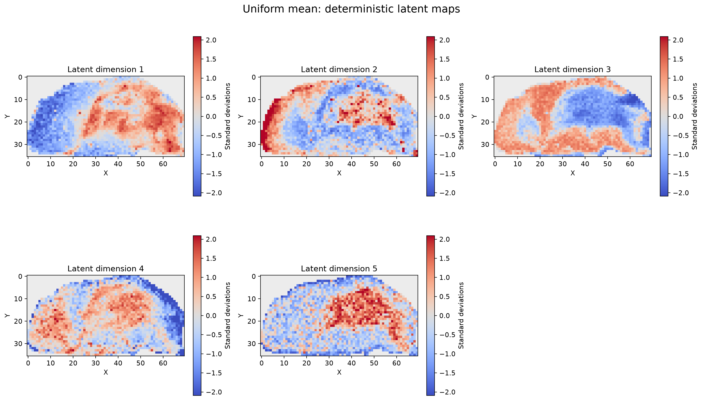
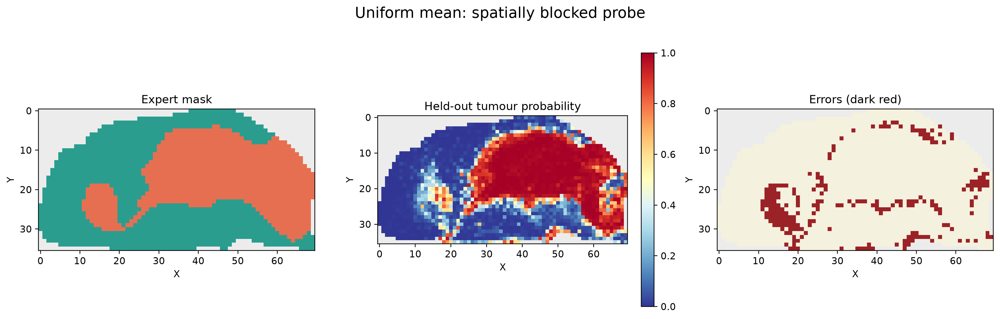

# Hairong progress meeting — 14 September 2026

Prepared 13 September from the synced repository, research notes and Notion plan. This is a progress briefing, not a claim that the final research evaluation is complete.

## Start here: the 90-second explanation

“When we last met, we had found CAC. Since then, I have built the data and evaluation pipeline, run S3PL across CAC and the eight MassNet GBM sections, and investigated a substantial gap between our GBM results and the published result.

We checked preprocessing, repeatability, spatial coordinates, masks and the original imzML files. The original files produced the same high/low pattern, so we have a documented partial reproduction rather than an exact reproduction.

Following Richard’s feedback, I have now implemented three ways of combining neighbouring spectra: a fixed mean, learned position-dependent weights, and attention. All three have completed matched 100-epoch runs on one GBM development section. Their latent representations separate normal and tumour tissue similarly, around 89% balanced accuracy in a spatially structured development probe. That is encouraging, but it is not yet a peak-selection result or unseen-patient validation.

The next steps are to check whether the learned neighbourhoods actually behave differently, add a matched no-context control, and implement nonlinear peak attribution with perturbation checks. I would like your guidance on the scope and evaluation protocol before scaling up.”

## Suggested meeting route: 25 minutes

- 3 minutes: research question and progress since CAC.
- 5 minutes: datasets, masks and visual evidence.
- 5 minutes: baseline reproduction and what remains unresolved.
- 7 minutes: the three neighbourhood models and current results.
- 5 minutes: agree the next experiments and what counts as success.

Use sections 1–6 for the conversation. The remaining sections are supporting notes for questions.

## 1. What are we trying to find out?

The working research question is:

**Can learned spatial context and nonlinear attribution improve MSI peak learning over fixed neighbourhood averaging and first-layer weight importance?**

Each measured tissue pixel contains a spectrum: intensity across many m/z values. Nearby pixels provide context about tissue structure. We want to identify informative spectral features, not merely reconstruct spectra or draw attractive tissue maps.

There are two distinct methodological questions:

1. **Spatial context:** how should neighbouring spectra contribute to the representation?
2. **Peak attribution:** how do we identify the m/z features responsible for the model’s tissue-related representation?

We are deliberately testing neighbourhoods first with spatial regularisation and augmentation switched off. Otherwise, several changes happen together and we cannot tell which caused an effect.

Richard’s feedback motivated the nonlinear attribution direction: a nonlinear encoder can learn interactions that the magnitude of its first-layer weights does not capture.

## 2. Data foundation: what we now have

| Collection | What it provides | Size used | Labels and main caveat |
|---|---|---|---|
| CAC | Human colorectal adenocarcinoma MSI; negative-mode DESI | 8 sections; 34,749 spectra; 1,481 m/z bins | Three-class model-derived pseudo-ground-truth masks, not expert ground truth. Exact biological interpretation of classes 1/2 still needs provenance confirmation. |
| MassNet GBM | Patient-derived xenograft mouse-brain GBM MSI | 8 sections; 26,327 spectra; 85,062 shared m/z bins | Normal/tumour labels transferred from histology; registration and boundary uncertainty remain. |
| Legacy msiPL GBM | The older Dataset_S1–S4 collection used to establish the original msiPL workflow | Four separately recorded runs | A separate collection, not interchangeable with the eight MassNet sections. |

The official GBM imzML release and the MassNet HDF5 files represent the same data for our comparison; they are not additional independent samples. Eight sections must not be presented as eight independent patients.

The MassNet file suffixes “positive” and “negative” should not be interpreted as ionisation polarity from their names alone.

### Why masks and coverage required work

The spectrum matrix and the tissue grid are not the same thing. Some grid positions have no measured spectrum. We reconstructed coordinates and masks, retained a separate measured-pixel indicator, and checked the label mapping:

- Raw MassNet label 1 → normal, stored mask class 0.
- Raw MassNet label 2 → tumour, stored mask class 1.
- Unmeasured positions must not silently become normal tissue.

| MassNet section | Measured pixels | Normal | Tumour | Grid coverage |
|---|---:|---:|---:|---:|
| GBM108_negative | 2,512 | 960 | 1,552 | 54.62% |
| GBM108_positive | 2,071 | 1,173 | 898 | 82.18% |
| GBM12_1 | 3,658 | 3,362 | 296 | 82.95% |
| GBM12_2 | 3,306 | 2,466 | 840 | 80.03% |
| GBM22_1 | 3,835 | 3,147 | 688 | 78.33% |
| GBM22_2 | 4,524 | 3,415 | 1,109 | 73.63% |
| GBM39_1 | 4,015 | 3,451 | 564 | 76.53% |
| GBM39_2 | 2,406 | 1,848 | 558 | 75.85% |

CAC 280TopL has approximately 89.98% rectangular-grid coverage; the other seven have full grid coverage. Missing positions are a data-handling consideration, not evidence that they caused the earlier cluster job to hang.

### What was implemented and checked

- Cluster extraction and inspection of the HDF5 files.
- Coordinate-aware normal/tumour masks, coverage maps and audit summaries.
- TIC, tissue-overlay and representative-ion visualisations.
- An S3PL HDF5 adapter, including spatial orientation and missing-neighbour handling.
- Synthetic checks, real-data validation, then a one-epoch smoke test before full runs.
- Original-imzML versus HDF5 comparisons: all eight coordinate sets and recoded masks agree; sampled spectra agree within floating-point tolerance.

**Why:** if spectra, masks and coordinates are misaligned, a training run can finish without producing scientifically meaningful results.

## 3. Baselines: what we ran and what we learned

### Original msiPL workflow

We established legacy msiPL runs on Dataset_S1–S4, including VAE representations, weight-based peak learning and visualisation. This supplied a reference implementation and exposed the first-layer-weight attribution limitation.

For scale only, the recorded S1 run used 3,570 pixels and 21,241 features, 100 epochs, latent dimension 5 and beta 2.5, producing 213 learned peaks. These settings/results are not a matched comparison with the new spatial model.

### S3PL on CAC: all eight completed

Configuration: 10 epochs, patch size 9, batch size 16, learning rate 0.01, spectral latent setting 256, seed 1.

| CAC section | mSCF1 |
|---|---:|
| 40TopL | 0.687 |
| 160TopL | 0.508 |
| 200TopL | 0.672 |
| 240TopL | 0.669 |
| 280TopL | 0.386 |
| 360TopL | 0.644 |
| 400TopL | 0.456 |
| 520TopL | 0.704 |
| **Mean** | **0.591** |

mSCF1 averages peak-selection F1 across Pearson-correlation thresholds 0.3, 0.4, 0.5 and 0.6. Here the reference peaks are defined using correlations between ion images and masks.

**This evaluates m/z selection against a mask-derived reference. It is not pixel classification accuracy, nor independent chemical identification.**

The recorded mean training/evaluation timer was about 72 seconds, but substantial loading/preprocessing lay outside that timer. Do not present it as total cluster wall time.

### S3PL on MassNet GBM: a documented partial reproduction

We first used patch size 9, then corrected to the paper-aligned GBM patch size 3 and reran all eight consistently.

| Section | Earlier p=9 | Released-code p=3 | Paper-described TIC p=3 sensitivity |
|---|---:|---:|---:|
| GBM108_negative | 0.565 | 0.664 | 0.291 |
| GBM108_positive | 0.409 | 0.033 | 0.267 |
| GBM12_1 | 0.122 | 0.145 | 0.236 |
| GBM12_2 | 0.338 | 0.512 | 0.292 |
| GBM22_1 | 0.215 | 0.295 | 0.304 |
| GBM22_2 | 0.358 | 0.339 | 0.347 |
| GBM39_1 | 0.274 | 0.255 | 0.282 |
| GBM39_2 | 0.488 | 0.281 | 0.291 |
| **Mean mSCF1** | **0.346** | **0.316** | **0.289** |

The reproduction audit records a published reference mean of **0.496**. We have not reproduced it. The released-code p=3 result is our executable baseline; TIC is a separate sensitivity analysis. We must not choose the best preprocessing separately for each section.

### How we investigated the gap

1. **Repeatability:** an identical GBM108_positive p=3 repeat reproduced losses, metrics, selected-peak and report hashes, including mSCF1 0.033. That makes a transient random run failure an unlikely explanation for this tested case.
2. **Geometry:** audited 18,639 neighbourhood entries for that section and checked centres, coordinates and masks.
3. **Preprocessing:** found a difference between the released helper’s spatial maximum normalisation and the paper’s TIC description. Ran the TIC alternative consistently across all eight.
4. **Original files:** located the official Mannheim imzML release linked through IonMorphNet and checked it against HDF5.
5. **Original reader route:** reran two diagnostic sections through imzML/m2aia:
   - Positive: 0.027 versus HDF5 0.033.
   - Negative: 0.655 versus HDF5 0.664.
   - Selected-bin overlaps were approximately 88.5% and 91.2%.

**Conclusion:** the original-file route preserves the same high/low pattern. It does not rescue the paper reproduction. This narrows the problem but does not identify the remaining cause.

We decided not to spend an unrestricted amount of time tuning toward a published number. Report the gap and provenance honestly, retain a consistent executable baseline, and proceed with controlled methodological experiments. Author contact is not currently planned.

## 4. Our spatial model: what changed, why and how

### Plain-language explanation

For each measured pixel, the model receives its own spectrum and a summary of its surrounding pixels. It compresses that information into five numbers, then tries to reconstruct the centre spectrum.

The three experiments differ in **how the neighbour summary is made**, while keeping the main model and training setup matched.

| Variant | What it does | Question it tests |
|---|---|---|
| Uniform mean | Averages available surrounding spectra equally | Is a simple fixed neighbourhood sufficient? |
| Depthwise | Learns m/z-specific weights for the eight neighbour positions | Are particular directions more useful at particular m/z values? |
| Attention | Uses learned content-dependent scores to weight available neighbours | Should useful neighbours depend on the local spectra rather than fixed position? |

The centre spectrum is retained separately. Unmeasured neighbours are masked out.

Our depthwise implementation is a normalised eight-position weighting with a separate centre, not an unrestricted nine-coefficient 3×3 convolution. That is an implementation adaptation of Richard’s suggestion and should be stated.

### Matched setup

- Development section: **GBM108_positive only**, all 2,071 measured pixels.
- TIC-normalised spectra; 85,062 m/z features.
- Centre and context concatenated into 170,124 inputs.
- Hidden width 512, latent dimension 5; decoder reconstructs the centre.
- Reconstruction objective plus KL regularisation, beta 1.
- Seed 1; matched initial VAE weights; 100 epochs; batch size 128.
- Adam, initial learning rate 0.001, cosine schedule.
- Spatial-loss coefficient 0; Poisson augmentation off.

This isolates neighbourhood choice. It does **not** yet test every part of the proposed method.

### What completed

After data checks, smoke tests, a GPU capacity check and five-epoch stability runs, all three 100-epoch production runs completed with finite losses.

| Variant | Training hours | Peak allocated GPU GiB | Final total training loss |
|---|---:|---:|---:|
| Uniform mean | 11.28 | 2.898 | 571,563 |
| Depthwise | 11.33 | 5.503 | 571,580 |
| Attention | 11.11 | 3.150 | 571,546 |

Each reduced its objective by about 33%. Tiny loss differences are not evidence of meaningful scientific superiority.

The model currently has approximately 130.8–131.4 million parameters, largely because of the dense full-spectrum encoder. It is computationally expensive. We have **not** demonstrated an efficiency improvement over S3PL; training protocols also differ.

## 5. What the latest evaluation actually tells us

We extracted deterministic latent means from each trained model and examined tissue structure in those representations.

### Three complementary checks

- **Logistic probe:** can a simple classifier recover normal/tumour labels from the five latent values?
- **Two-component GMM:** does unsupervised grouping agree with the labels?
- **Spatial/latent maps:** are patterns coherent, and where are errors or boundaries?

The VAE did not use tissue labels for training. Labels were used to evaluate its representation and train the probe.

The probe used 4×4 spatial tiles, 16 folds, a one-pixel halo, training-fold scaling and a balanced logistic classifier without a tuning sweep.

| Variant | Balanced accuracy | Macro F1 | ROC AUC | GMM ARI |
|---|---:|---:|---:|---:|
| Uniform mean | 0.8902 | 0.8900 | 0.9624 | 0.6443 |
| Depthwise | 0.8921 | 0.8919 | 0.9618 | 0.6412 |
| Attention | 0.8940 | 0.8939 | 0.9651 | 0.6290 |

### Safe interpretation

The representations contain tissue-label information. All three are similar; the largest balanced-accuracy gap is only **0.38 percentage points**, from one section and one training seed. Attention is not established as the winner, and uniform mean has the highest GMM ARI.

These are **development/transductive representation results**:

- The unsupervised encoder saw all spectra in this section.
- A one-pixel halo removes immediately adjacent training centres, but radius-one neighbourhoods can still share input pixels across the split.
- Therefore this is not a strictly leakage-free spatial generalisation test.
- It is not evidence of performance on unseen sections or patients.
- Balanced accuracy around 89% cannot be compared numerically to S3PL mSCF1 around 0.316: they measure different things.

### The diagnostic issue we are checking

The current attention summary reports maximum normalised weight entropy, consistent with uniform weighting on the evaluated data. Learned attention may not currently be doing something meaningfully different from averaging.

A revised diagnostic was prepared to inspect per-channel depthwise entropy, deviation from uniform weights, attention logit spread and tanh saturation. The synced evaluation still contains the earlier diagnostics; the revised result is not yet available here.

**Do not say saturation has been proved.** It is a hypothesis to test.

## 6. Proposed next steps and questions for Hairong

These are proposals for agreement, not completed experiments.

| Order | Next step | Why / decision gate |
|---|---|---|
| 1 | Review revised neighbourhood diagnostics | Establish whether the learned variants actually use non-uniform context before expanding runs. |
| 2 | Add a matched centre-only/no-context VAE control | Without it we cannot claim spatial context improves over no spatial context. |
| 3 | Agree stricter evaluation and repeats | Multiple seeds; stronger spatial separation; development versus held-out section/patient protocol. A halo of at least two is relevant for non-overlapping radius-one inputs, but alone does not remove transductive encoder exposure. |
| 4 | Implement GMM-targeted Integrated Gradients | Attribute cluster-related behaviour through the nonlinear model, not just its first layer. |
| 5 | Check attribution completeness and perturbation faithfulness | Removing highly ranked features should affect the target more than suitable controls. |
| 6 | Compare peak quality under one fixed protocol | Same dataset handling, selection rules and metrics; include first-layer L2 and S3PL comparators where applicable. |
| 7 | Introduce spatial regularisation and Poisson augmentation separately | Isolate their effects after the base neighbourhood comparison is understood. |
| 8 | Scale to remaining sections, seeds and computational reporting | Assess robustness, uncertainty and cost rather than a single promising section. |

### Decisions to ask for

1. Is the documented **partial S3PL reproduction** sufficient as a baseline, or is another bounded reproduction check necessary?
2. Should our contribution prioritise **nonlinear attribution**, neighbourhood learning, or a deliberately smaller combination?
3. Is GBM108_positive acceptable as the development section, and what grouping defines independent held-out evaluation?
4. What peak-evaluation evidence is sufficient given CAC pseudo-labels and GBM histology-registration uncertainty?
5. Should we simplify the large dense encoder before a broader experimental sweep?
6. Are the proposed centre-only control and separate ablations the right minimum experiment set?

Suggested ownership: Zayd implements and reports; Hairong advises on scope/protocol. Agree milestones during the meeting rather than inventing deadlines now.

## 7. Visual walkthrough: show these five things

### A. CAC: spectra really belong to a tissue grid

Explain: “This connects measured ion intensity to the spatial labels used for peak evaluation. Those labels are model-derived, not expert ground truth.”

### B. GBM: eight sections and imperfect coverage

Explain: “We have normal/tumour masks, but blank grid positions are not normal tissue. The tissue shapes and class balance differ substantially between sections.”

### C. Current comparison: no convincing neighbourhood winner

Explain: “These are representation metrics on one development section, not peak-quality results. The differences are small.”

### D. What the compressed representation looks like

Explain: “Each map shows one learned latent coordinate across the tissue. It is a learned feature, not a named molecule.”

### E. Where the label probe succeeds and fails

Explain: “The broad tissue region is distinguishable, but some smaller regions and boundaries remain difficult. A disagreement is not proof the annotation is wrong.”

## 8. Richard’s feedback: incorporated versus planned

| Feedback | Our response | Status |
|---|---|---|
| Compare fixed mean, depthwise and attention neighbourhoods | Three matched contextual VAE variants | Implemented; one-section production and representation evaluation completed |
| First-layer weights miss nonlinear interactions | Plan attribution through the whole encoder/context computation | Agreed direction; not implemented |
| Target GMM cluster membership with IG | Differentiable cluster-posterior attribution, deterministic means and reproducible GMM | Planned |
| Validate importance by perturbation/occlusion | Compare effects of removing ranked features against controls | Planned |
| Keep computation manageable | Avoid a full cross-channel spatial convolution | Partial: neighbourhood overhead bounded, but dense encoder remains very large |

The two-component GMM used in the latest descriptive evaluation is not yet the final cluster-selection/attribution protocol.

## 9. Practical work supporting the science

We also built reusable Slurm scripts, result/provenance capture, restartable training and local result synchronisation.

- CUDA failures occurred before model allocation on several nodes; these are logged separately from scientific failures.
- The old job stuck in COMPLETING eventually cleared. There is no evidence that our experiment physically damaged a node.
- Checkpoints are saved periodically, with optimiser/scheduler/RNG state for resumption, outside the Git repository on cluster storage.
- A checkpoint-directory race was addressed.
- Logs, metric files and plots are retained; large raw data/checkpoints should stay outside routine Git and local rsync transfers.
- Notion holds the research plan and concise decisions; Obsidian contains historical explanations.

These details matter for repeatability but need not dominate the meeting.

## 10. Short glossary and likely questions

**m/z bin:** a position on the mass-to-charge axis. Selecting a bin does not by itself identify a molecule.

**TIC normalisation:** divide a spectrum by its total intensity, reducing variation in overall signal scale.

**VAE:** a model that compresses spectra into a small latent representation and reconstructs them, with regularisation on that representation.

**KL term:** the regulariser encouraging a structured latent distribution; not an additional tissue-label loss.

**Depthwise:** here, separate positional neighbourhood weights for each m/z feature.

**Attention:** weights derived from the local spectral content. Learning an attention module does not guarantee non-uniform weights.

**GMM:** probabilistic grouping into Gaussian components. Here it is a representation check; later it can provide an attribution target.

**Integrated Gradients:** measures how input changes along a baseline-to-input path contribute to a chosen model output. The baseline and target must be specified and validated.

**Balanced accuracy:** average recall across classes; useful when tumour and normal counts differ.

**ARI:** adjusted agreement between cluster assignments and labels. It is not percentage classification accuracy.

**Transductive:** the representation learner has seen the evaluation samples’ spectra, even if not their labels.

**“Have we improved peak learning?”** Not established yet. The new model’s peak attribution and matched peak-quality evaluation are still ahead.

**“Have we reproduced the paper?”** Partially. We have consistent executable baselines and substantial checks, but the GBM reported mean remains unreproduced.

**“Why not run everything now?”** First establish that learned neighbourhoods behave as intended and agree the controls/splits. More runs of an unclear comparison would consume substantial GPU time without answering the core question.

**“Why not just use the best-looking variant?”** One section, one seed and small differences are insufficient. Choosing post hoc risks overstating the result.

## 11. Evidence and records

Primary numerical sources:

- [S3PL reproduction audit](../../code/msi/results/baselines/s3pl/massnet_gbm_reproduction/README.md)
- [Latest neighbourhood comparison JSON](../../code/msi/results/experiments/spatial_msipl_neighbourhood_evaluation/GBM108_positive_seed1/comparison.json)
- [Original imzML/HDF5 comparison](../../code/msi/results/validation/gbm_imzml_h5/comparison.json)
- [Original-format visual comparison summary](../../code/msi/results/visualisations/gbm_imzml_comparison/summary.json)
- [Legacy msiPL S1 result](../../code/msi/results/baselines/msipl/legacy/Dataset_S1/results.json)

Planning context:

- [Notion Research](https://app.notion.com/p/3c0946087a7d80858061dbf531bdbc1f)
- [Neighbourhood and ablation plan](https://app.notion.com/p/3c2946087a7d819289a7dc01129b6175)
- [Nonlinear attribution plan](https://app.notion.com/p/3c2946087a7d816cb723efcaa7e1c00c)

Historical explanation sources in the Obsidian vault, Research/MSI Research:

- 2026-08-21 - S3PL and MassNet GBM Progress
- 2026-08-23 - CAC S3PL Baseline Complete
- 2026-09-11 - MassNet S3PL p9 Audit and p3 Reproduction
- 2026-09-12 - Spatial-msiPL Neighbourhood Validation and Production Launch
- Datasets - CAC and MassNet GBM
- Richard's Methodological Feedback
- S3PL Baseline and Experiment Log

When historical notes or Notion status conflict with completed synced artifacts, this briefing uses the artifacts for completion/results. The published S3PL reference and acquisition provenance here are carried from the existing research audit/notes, not newly re-reviewed literature in this meeting-preparation task.

## 12. Fill in during the meeting

- Agreed contribution:
- Required reproduction work, if any:
- Development/held-out split:
- Minimum controls and seeds:
- Attribution target and validation:
- Next milestone:

