# Results Record

Last updated: 2026-09-20

This is the main results ledger. Values are copied from the committed JSON and
CSV outputs. “Complete” means the planned computation and audit finished; it
does not automatically mean the scientific hypothesis was supported.

## Executive summary

- Both datasets were inspected, visualised and aligned with their masks.
- Legacy msiPL was reproduced on all eight GBM and eight CAC sections.
- The tuned msiPL reproduction is descriptively consistent with the published
  Weigand et al. aggregate on both collections.
- The S3PL GBM reproduction remains below the paper value despite format and
  normalisation checks; this gap is documented rather than hidden.
- Three spatial neighbourhood mechanisms were tested. Their development-section
  representation scores were very similar, so the parameter-free uniform mean
  was frozen as the simplest method.
- Across all eight GBM sections, uniform spatial context did **not** consistently
  improve reconstruction over a centre-only VAE.
- On the development section, nonlinear Integrated Gradients selected markedly
  better peaks than legacy msiPL and first-layer L2. Whole-GBM validation is in
  progress and must finish before this becomes a general conclusion.

## Dataset validation

### MassNet GBM

All eight HDF5 sections contain a shared 85,062-bin m/z axis from approximately
101.924 to 999.986. Expert H&E annotations distinguish normal and tumour tissue.
Coverage ranges from 54.62% to 82.95% because unmeasured grid positions exist.

The reconstructed HDF5 masks and official imzML masks had zero semantic
disagreements across every measured pixel. Their numeric encodings differ, but
their biological meaning does not.

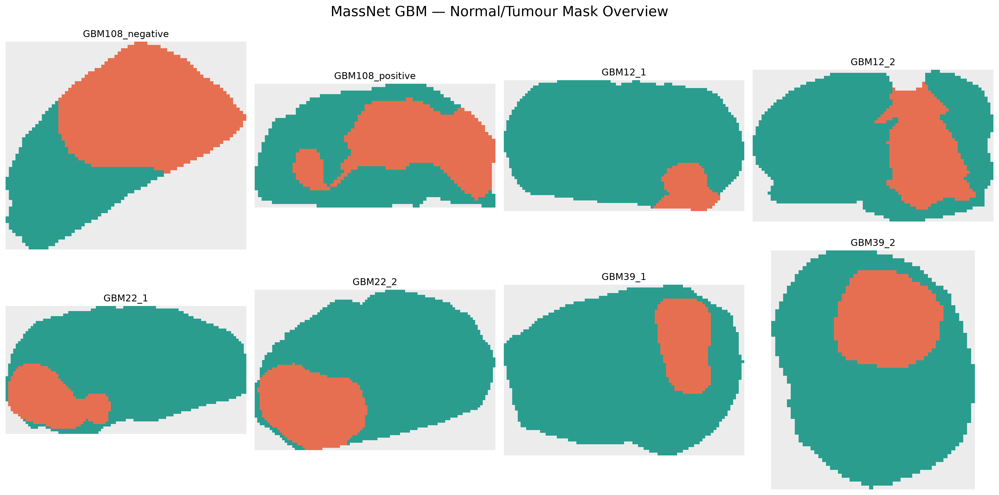

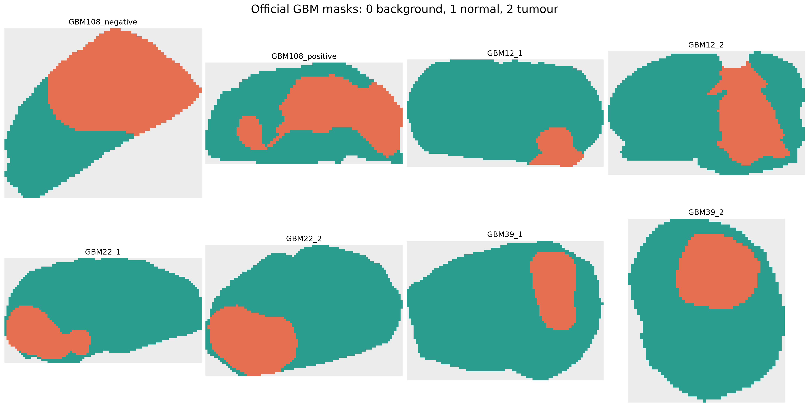

### CAC

The eight CAC sections have 1,481 bins and three mask classes. Seven sections
have complete rectangular MSI coverage. `280TopL` has 4,160 measured spectra on
a 4,623-pixel grid, or 89.98% coverage; processing therefore uses measured
coordinates rather than assuming a dense grid.

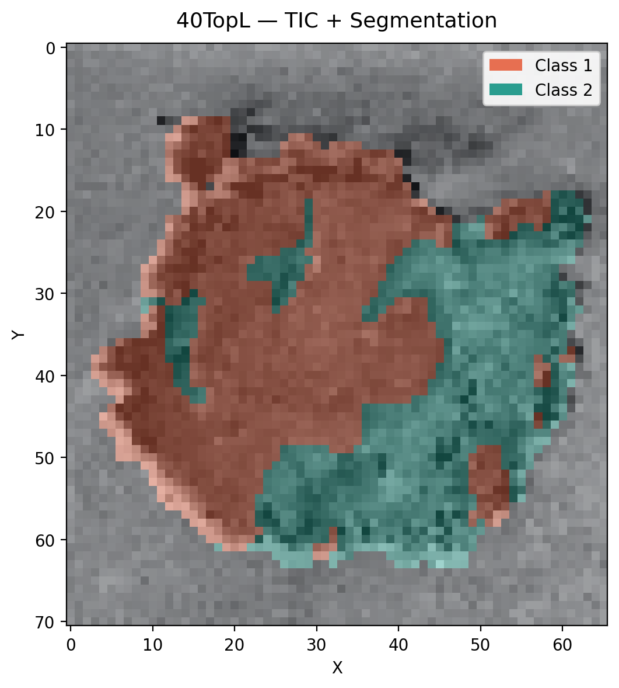

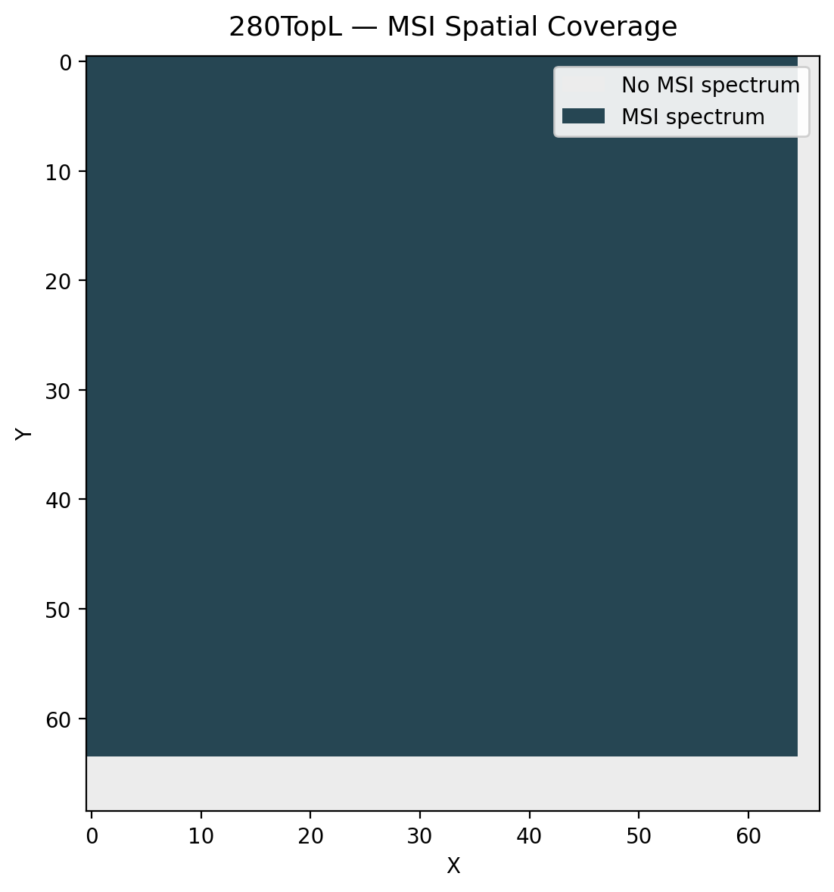

## Legacy msiPL reproduction

The first complete run used the legacy VAE-BN and LearnPeaks implementation.
Subsequent beta selection produced the paper-aligned comparison used as the
main msiPL reproduction.

| Collection | Initial mean mSCF1 | Tuned mean mSCF1 | Paper mean | Paper 95% interval | Tuned result inside interval? |
|---|---:|---:|---:|---:|---|
| GBM | 0.364 | 0.414 | 0.403 | 0.330–0.475 | Yes |
| CAC | 0.219 | 0.402 | 0.431 | 0.391–0.479 | Yes |

Interval membership is descriptive consistency, not statistical equivalence or
proof that every undocumented detail of the paper was reproduced.

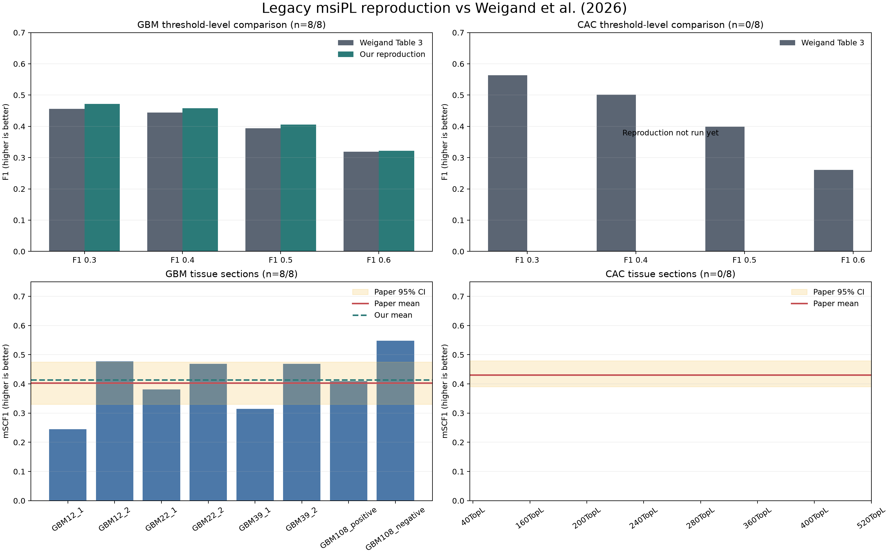

## S3PL reproduction

### CAC

S3PL was successfully executed across the CAC sections using the repository’s
10-epoch configuration. The first completed `40TopL` run produced mSCF1 0.687
with 342 selected peaks and demonstrated that the adapter, masks and evaluation
path worked. The remaining sections were then completed.

### MassNet GBM

The paper-aligned spatial patch size is 3. With the released-code spatial-maximum
normalisation, the eight-section mean mSCF1 was 0.3155, versus 0.496 reported in
the paper. Paper-described TIC normalisation produced 0.28875. An earlier
patch-size-9 transfer run produced 0.3461 but is not paper-aligned.

Official imzML pilots also failed to close the gap:

- `GBM108_positive`: 0.033 in HDF5 versus 0.027 in official imzML.
- `GBM108_negative`: 0.664 in HDF5 versus 0.655 in official imzML.

Therefore the discrepancy is unlikely to be explained by HDF5 conversion,
mask geometry, coordinate order or simply switching to official imzML. The
executable baseline is retained, while the published value is not claimed as
reproduced.

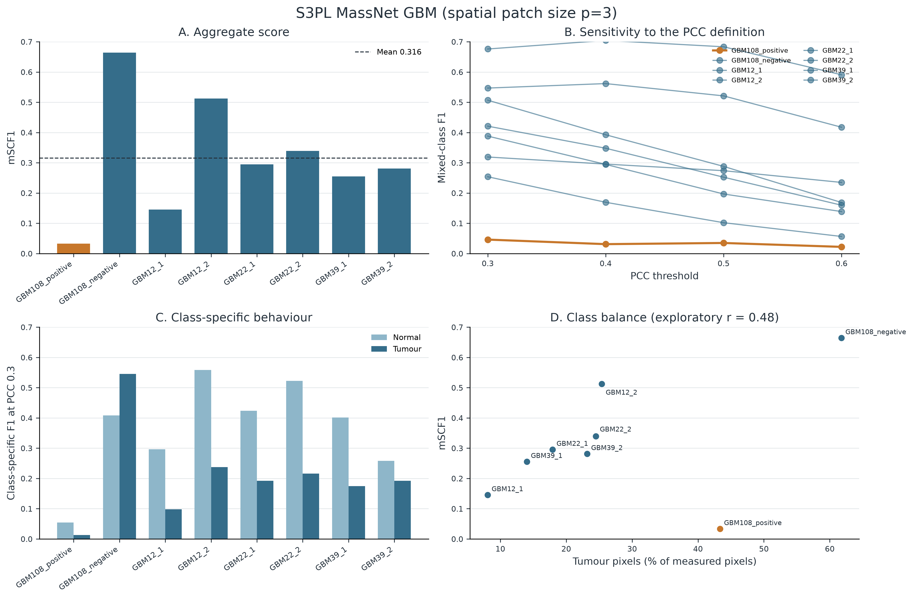

## Spatial-msiPL neighbourhood development

Three ways of summarising the eight-position Moore neighbourhood were compared
on `GBM108_positive` after matched 100-epoch training.

| Variant | Balanced accuracy | Macro F1 | ROC AUC | GMM ARI | Mean Moran’s I |
|---|---:|---:|---:|---:|---:|
| Uniform mean | 0.890 | 0.890 | 0.962 | 0.644 | 0.744 |
| Depthwise | 0.892 | 0.892 | 0.962 | 0.641 | 0.740 |
| Attention | 0.894 | 0.894 | 0.965 | 0.629 | 0.744 |
| Attention, sqrt-bin scaling | 0.885 | 0.885 | 0.960 | 0.630 | 0.746 |

The differences were small and inconsistent across metrics. Uniform mean has no
learnable neighbourhood parameters, is orientation-free and is easier to
explain. It was therefore frozen for broader validation rather than choosing a
more complex method from a marginal development-section difference.

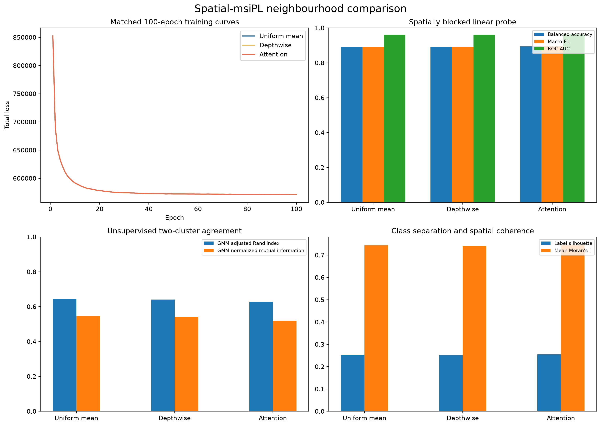

## Spatial-loss and Poisson development gates

Adding explicit adjacent-latent MSE reduced neighbour latent distances, but
stronger penalties worsened reconstruction and did not consistently improve
the held-out spatial probe. This showed that spatial smoothness can be forced
without necessarily creating a better representation.

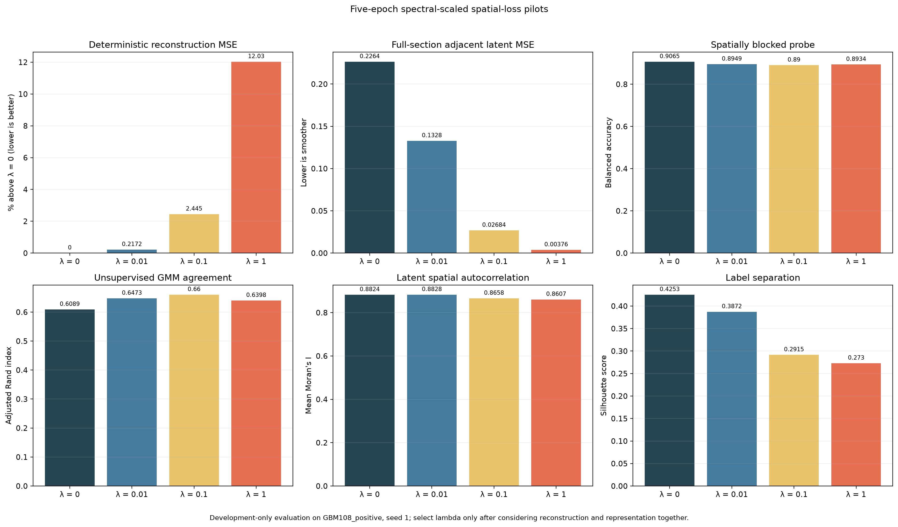

Poisson augmentation passed the allowed clean-reconstruction regression rule
but failed the predeclared requirement for at least 1% improvement on noisy
inputs. Its observed noisy-MSE change was only about 0.022%, so it was not
promoted into the frozen production method.

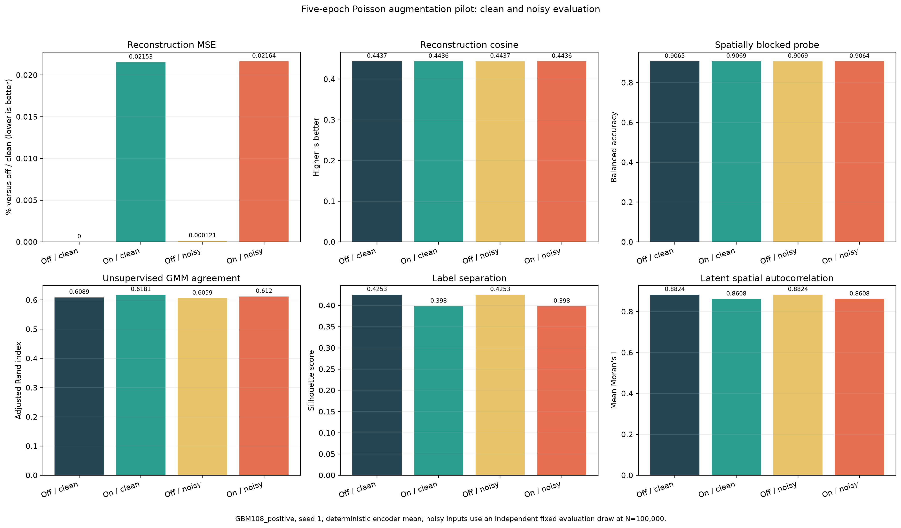

## Whole-GBM reconstruction validation

All 14 new frozen configurations—uniform mean and centre-only for the seven
non-development sections—completed 100 epochs and passed the strict audit.
Together with `GBM108_positive`, this gives eight paired sections.

| Section | Uniform-mean MSE change vs centre-only |
|---|---:|
| GBM108_positive | +15.97% |
| GBM108_negative | −0.68% |
| GBM12_1 | −3.80% |
| GBM12_2 | +7.50% |
| GBM22_1 | −3.58% |
| GBM22_2 | −36.20% |
| GBM39_1 | +1.92% |
| GBM39_2 | +1.72% |

Negative means uniform mean reconstructed better. The result is mixed:

- MSE wins: 4 uniform mean, 4 centre-only.
- Mean relative change: −2.14%, heavily influenced by `GBM22_2`.
- Median relative change: +0.52%, slightly favouring centre-only.
- Paired Wilcoxon MSE p-value: 0.945.
- Mean cosine change: +0.000114.
- Mean training-runtime ratio: 1.002.

Uniform mean uses 130,751,056 parameters versus 87,199,312 for centre-only and
about 2.90 GiB versus 2.05 GiB peak allocated GPU memory. The defensible result
is that spatial context does not consistently improve reconstruction and costs
more memory. Its value must be judged through representation and peak quality.

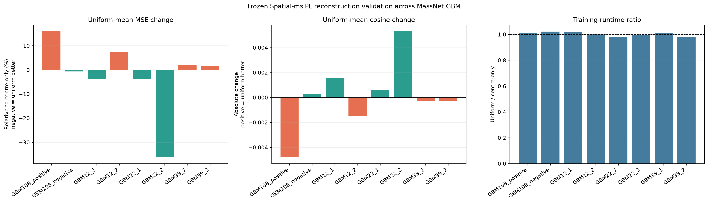

## Nonlinear peak attribution pilot

On frozen `GBM108_positive`, a two-component label-free GMM was fitted to the
five-dimensional latent means. Integrated Gradients then attributed each GMM
posterior through the complete nonlinear encoder to the central spectrum and
its neighbourhood context.

At a matched budget of 530 bins:

| Method | mSCF1 |
|---|---:|
| Spatial-msiPL Integrated Gradients | 0.528 |
| Legacy msiPL | 0.404 |
| First-layer L2 | 0.068 |

The GMM-to-mask balanced accuracy was 0.893, ARI was 0.644 and NMI was 0.545.
Integrated Gradients passed its numerical completeness check. Deleting its
high-ranked bins caused much larger posterior drops than deleting L2-ranked or
random bins, supporting faithfulness on this development section.

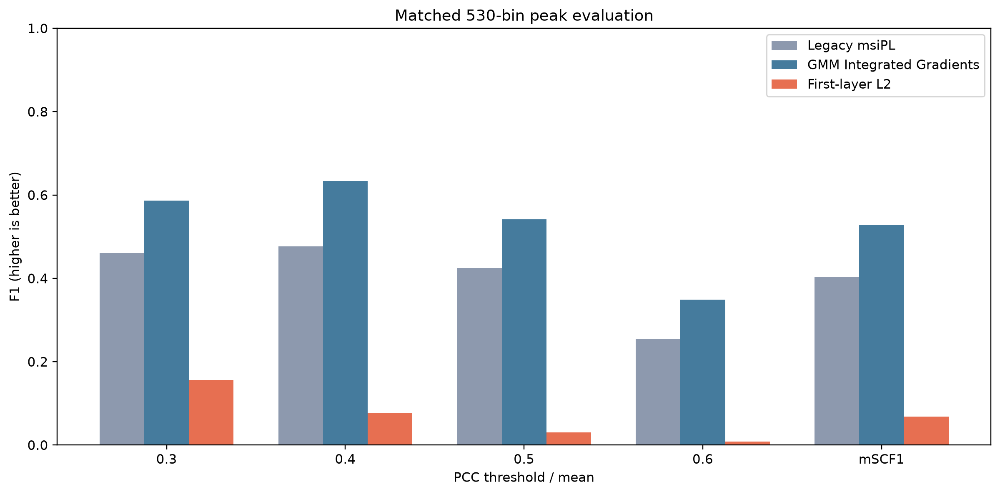

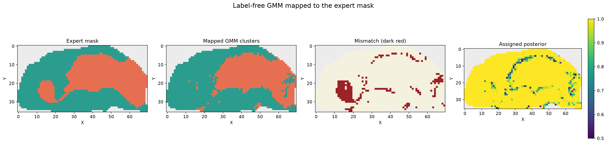

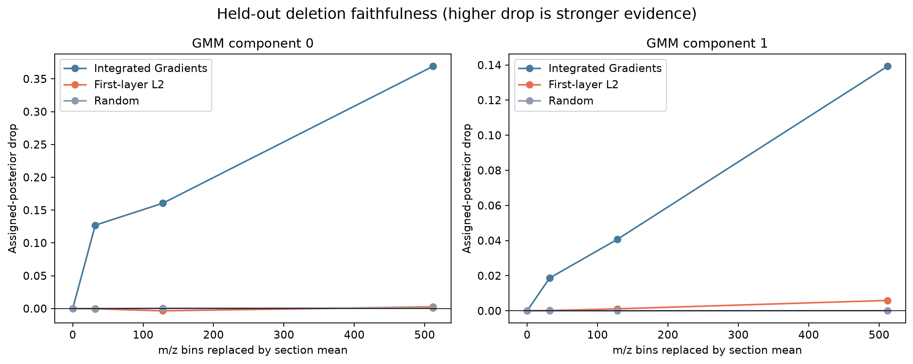

## Attribution sampling stability

Four attribution-pixel sampling runs produced mean mSCF1 0.533, standard
deviation 0.0137 and range 0.0310. Pairwise Jaccard similarity for the complete
530-bin sets was roughly 0.78–0.86. This indicates stable conclusion-level peak
quality and substantial, though not perfect, exact-set stability.

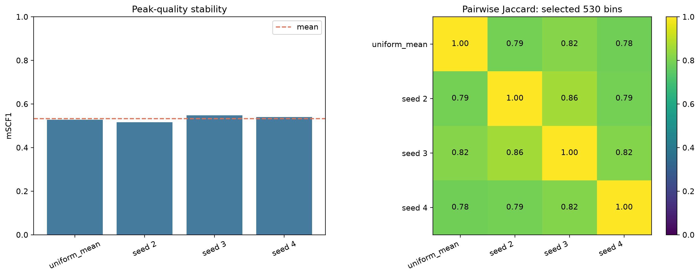

## Result currently in progress

The whole-GBM attribution campaign will compare Integrated Gradients, legacy
msiPL and first-layer L2 at each section’s own legacy peak count. The completed
development result must not be described as a whole-GBM result until this
campaign and its aggregate summary finish.
