# Results Record

Last updated: 2026-10-04

This is the main results ledger. Values are copied from the committed JSON and
CSV outputs. “Complete” means the planned computation and audit finished; it
does not automatically mean the scientific hypothesis was supported.

## Executive summary

- Both datasets were inspected, visualised and aligned with their masks.
- Legacy msiPL was reproduced on all eight GBM and eight CAC sections.
- The tuned msiPL reproduction is descriptively consistent with the published
  Weigand et al. aggregate on both collections.
- The S3PL GBM reproduction remains below the paper value despite format and
  normalisation checks; this gap is documented rather than hidden.
- Three spatial neighbourhood mechanisms were tested. Their development-section
  representation scores were very similar, so the parameter-free uniform mean
  was frozen as the simplest *baseline* for the initial validation, not
  established as the best spatial method.
- Across all eight GBM sections, uniform spatial context did **not** consistently
  improve reconstruction over a centre-only VAE.
- Across all eight GBM sections, nonlinear Integrated Gradients from both the
  spatial and centre-only VAEs selected better peaks than legacy msiPL.
- The matched centre-only control found no consistent peak-selection advantage
  from neighbourhood context; the robust gain comes from nonlinear attribution.

## Dataset validation

### MassNet GBM

All eight HDF5 sections contain a shared 85,062-bin m/z axis from approximately
101.924 to 999.986. Expert H&E annotations distinguish normal and tumour tissue.
Coverage ranges from 54.62% to 82.95% because unmeasured grid positions exist.

The reconstructed HDF5 masks and official imzML masks had zero semantic
disagreements across every measured pixel. Their numeric encodings differ, but
their biological meaning does not.

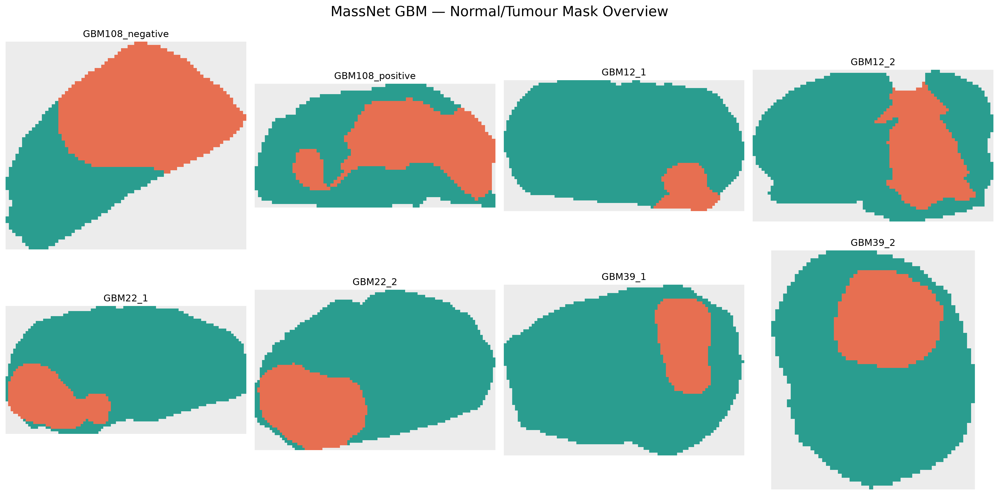

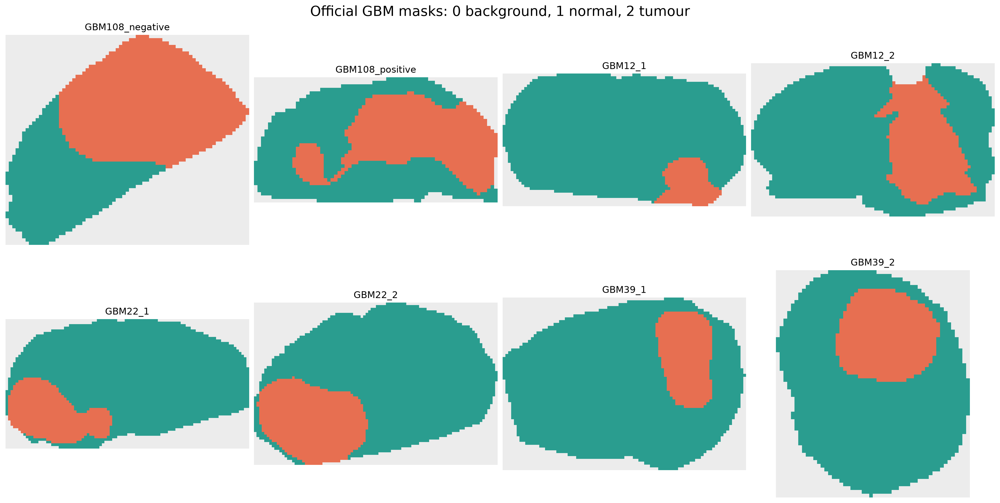

### CAC

The eight CAC sections have 1,481 bins and three mask classes. Seven sections
have complete rectangular MSI coverage. `280TopL` has 4,160 measured spectra on
a 4,623-pixel grid, or 89.98% coverage; processing therefore uses measured
coordinates rather than assuming a dense grid.

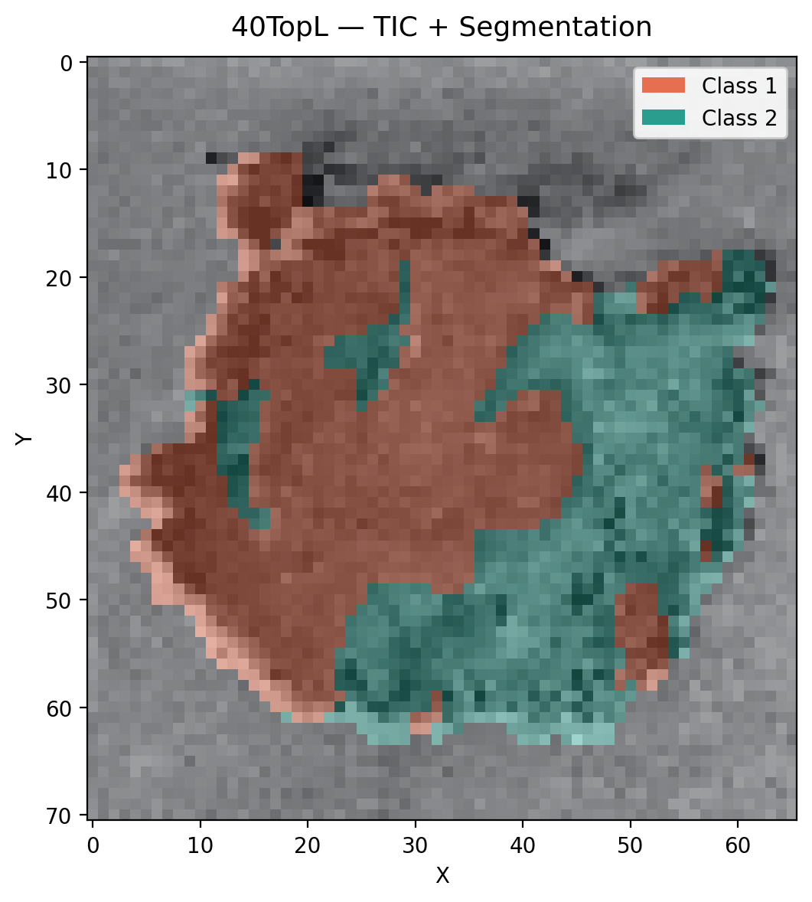

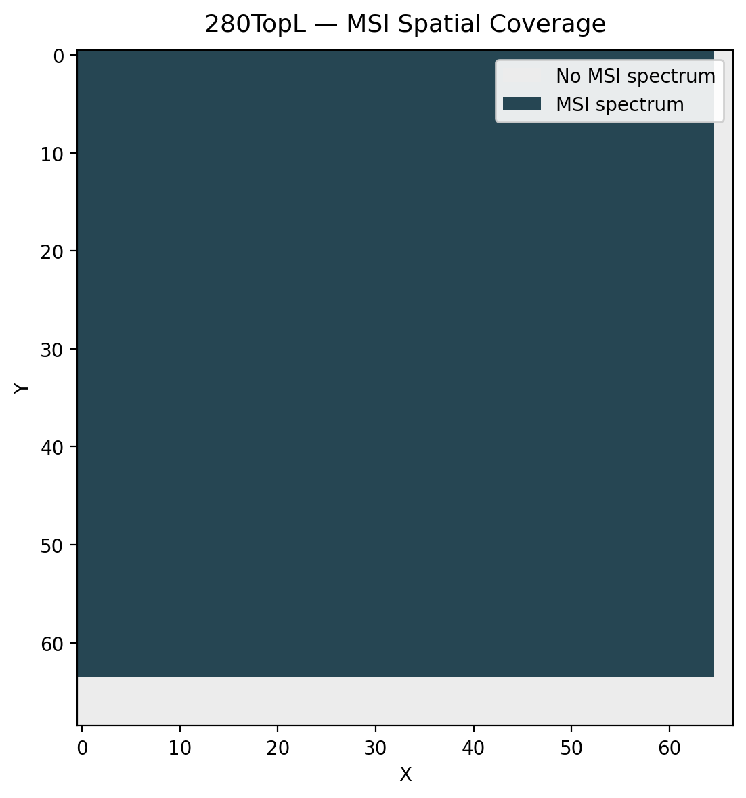

## Legacy msiPL reproduction

The first complete run used the legacy VAE-BN and LearnPeaks implementation.
Subsequent beta selection produced the paper-aligned comparison used as the
main msiPL reproduction.

| Collection | Initial mean mSCF1 | Tuned mean mSCF1 | Paper mean | Paper 95% interval | Tuned result inside interval? |
|---|---:|---:|---:|---:|---|
| GBM | 0.364 | 0.414 | 0.403 | 0.330–0.475 | Yes |
| CAC | 0.219 | 0.402 | 0.431 | 0.391–0.479 | Yes |

Interval membership is descriptive consistency, not statistical equivalence or
proof that every undocumented detail of the paper was reproduced.

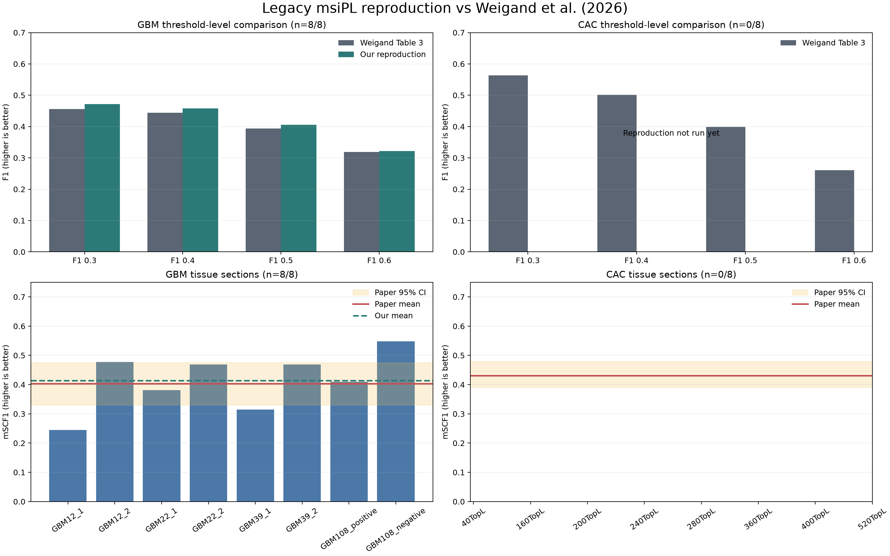

## S3PL reproduction

### CAC

S3PL was successfully executed across the CAC sections using the repository’s
10-epoch configuration. The first completed `40TopL` run produced mSCF1 0.687
with 342 selected peaks and demonstrated that the adapter, masks and evaluation
path worked. The remaining sections were then completed.

### MassNet GBM

The paper-aligned spatial patch size is 3. With the released-code spatial-maximum
normalisation, the eight-section mean mSCF1 was 0.3155, versus 0.496 reported in
the paper. Paper-described TIC normalisation produced 0.28875. An earlier
patch-size-9 transfer run produced 0.3461 but is not paper-aligned.

Official imzML pilots also failed to close the gap:

- `GBM108_positive`: 0.033 in HDF5 versus 0.027 in official imzML.
- `GBM108_negative`: 0.664 in HDF5 versus 0.655 in official imzML.

Therefore the discrepancy is unlikely to be explained by HDF5 conversion,
mask geometry, coordinate order or simply switching to official imzML. The
executable baseline is retained, while the published value is not claimed as
reproduced.

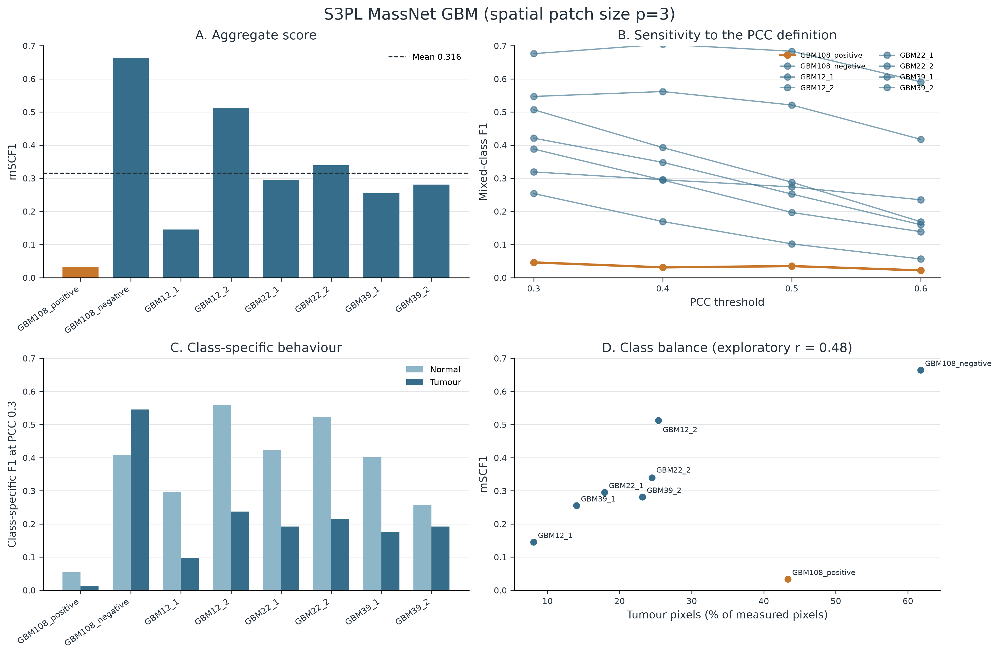

## Spatial-msiPL neighbourhood development

Three ways of summarising the eight-position Moore neighbourhood were compared
on `GBM108_positive` after matched 100-epoch training.

| Variant | Balanced accuracy | Macro F1 | ROC AUC | GMM ARI | Mean Moran’s I |
|---|---:|---:|---:|---:|---:|
| Uniform mean | 0.890 | 0.890 | 0.962 | 0.644 | 0.744 |
| Depthwise | 0.892 | 0.892 | 0.962 | 0.641 | 0.740 |
| Attention | 0.894 | 0.894 | 0.965 | 0.629 | 0.744 |
| Attention, sqrt-bin scaling | 0.885 | 0.885 | 0.960 | 0.630 | 0.746 |

The differences were small and inconsistent across metrics. Uniform mean has no
learnable neighbourhood parameters, is orientation-free and is easier to
explain. It was therefore frozen for broader validation rather than choosing a
more complex method from a marginal development-section difference.

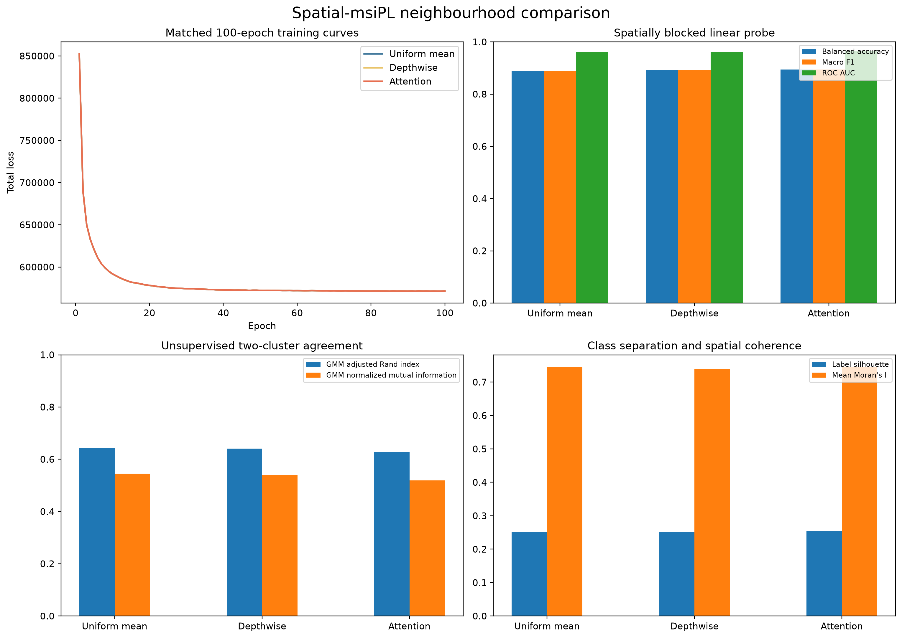

## Spatial-loss and Poisson development gates

Adding explicit adjacent-latent MSE reduced neighbour latent distances, but
stronger penalties worsened reconstruction and did not consistently improve
the held-out spatial probe. This showed that spatial smoothness can be forced
without necessarily creating a better representation.

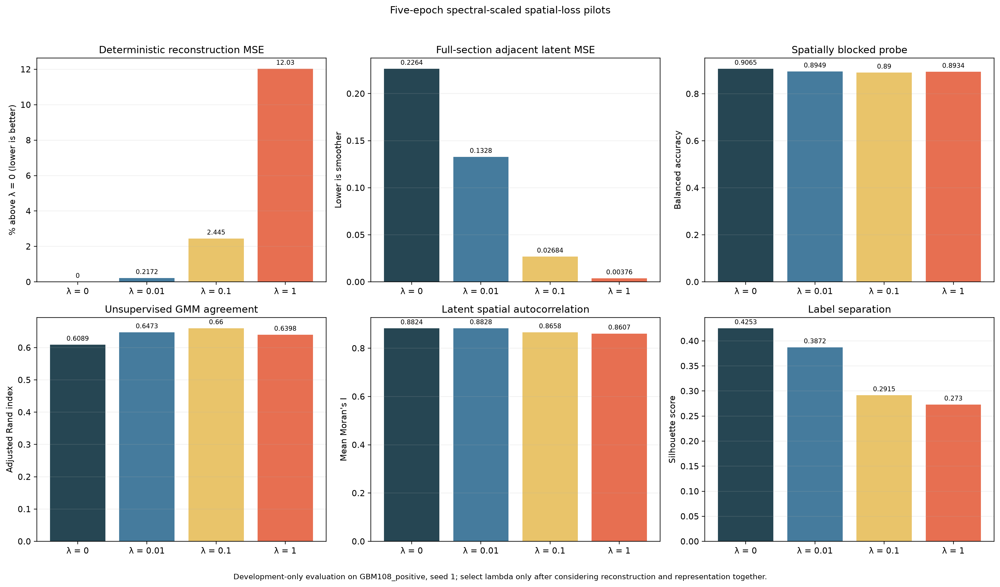

Poisson augmentation passed the allowed clean-reconstruction regression rule
but failed the predeclared requirement for at least 1% improvement on noisy
inputs. Its observed noisy-MSE change was only about 0.022%, so it was not
promoted into the frozen production method.

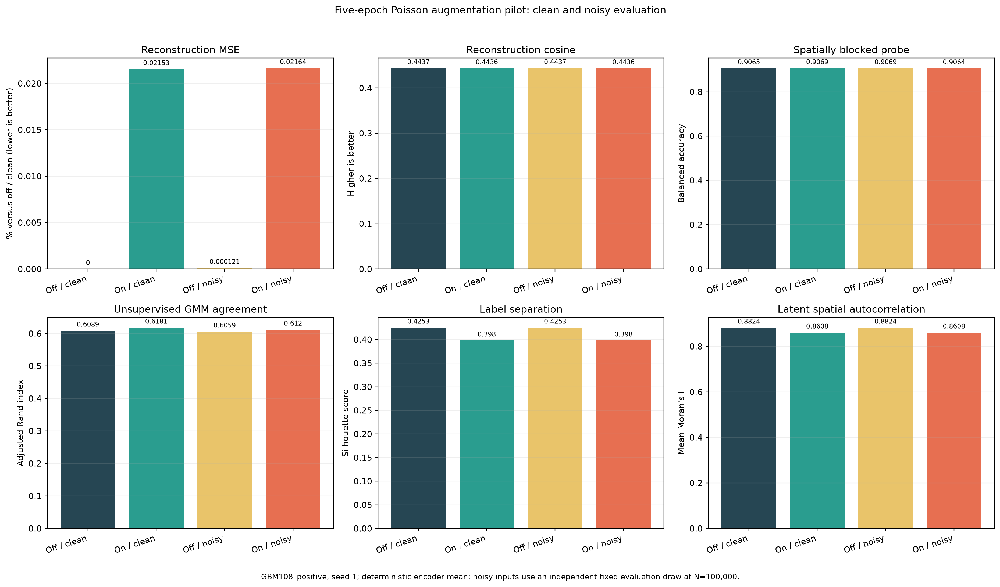

## Whole-GBM reconstruction validation

All 14 new frozen configurations—uniform mean and centre-only for the seven
non-development sections—completed 100 epochs and passed the strict audit.
Together with `GBM108_positive`, this gives eight paired sections.

| Section | Uniform-mean MSE change vs centre-only |
|---|---:|
| GBM108_positive | +15.97% |
| GBM108_negative | −0.68% |
| GBM12_1 | −3.80% |
| GBM12_2 | +7.50% |
| GBM22_1 | −3.58% |
| GBM22_2 | −36.20% |
| GBM39_1 | +1.92% |
| GBM39_2 | +1.72% |

Negative means uniform mean reconstructed better. The result is mixed:

- MSE wins: 4 uniform mean, 4 centre-only.
- Mean relative change: −2.14%, heavily influenced by `GBM22_2`.
- Median relative change: +0.52%, slightly favouring centre-only.
- Paired Wilcoxon MSE p-value: 0.945.
- Mean cosine change: +0.000114.
- Mean training-runtime ratio: 1.002.

Uniform mean uses 130,751,056 parameters versus 87,199,312 for centre-only and
about 2.90 GiB versus 2.05 GiB peak allocated GPU memory. The defensible result
is that spatial context does not consistently improve reconstruction and costs
more memory. Its value must be judged through representation and peak quality.

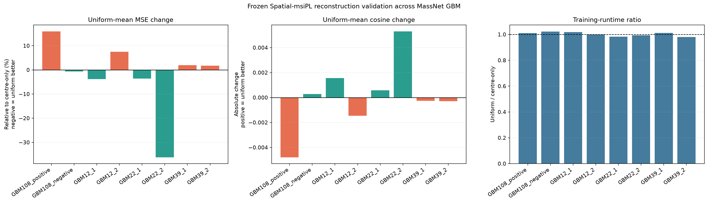

## Nonlinear peak attribution pilot

On frozen `GBM108_positive`, a two-component label-free GMM was fitted to the
five-dimensional latent means. Integrated Gradients then attributed each GMM
posterior through the complete nonlinear encoder to the central spectrum and
its neighbourhood context.

At a matched budget of 530 bins:

| Method | mSCF1 |
|---|---:|
| Spatial-msiPL Integrated Gradients | 0.528 |
| Legacy msiPL | 0.404 |
| First-layer L2 | 0.068 |

The GMM-to-mask balanced accuracy was 0.893, ARI was 0.644 and NMI was 0.545.
Integrated Gradients passed its numerical completeness check. Deleting its
high-ranked bins caused much larger posterior drops than deleting L2-ranked or
random bins, supporting faithfulness on this development section.

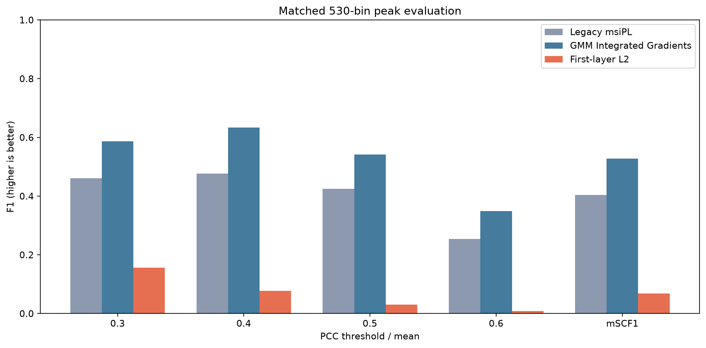

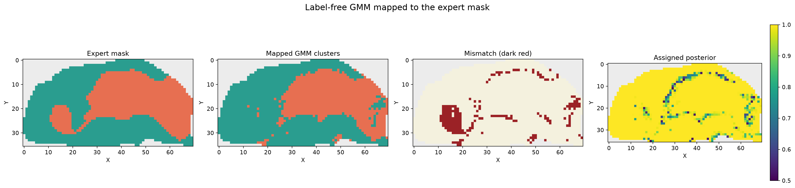

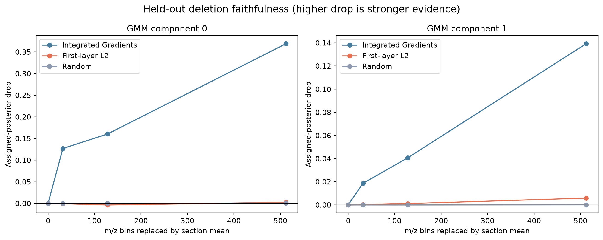

## Attribution sampling stability

Four attribution-pixel sampling runs produced mean mSCF1 0.533, standard
deviation 0.0137 and range 0.0310. Pairwise Jaccard similarity for the complete
530-bin sets was roughly 0.78–0.86. This indicates stable conclusion-level peak
quality and substantial, though not perfect, exact-set stability.

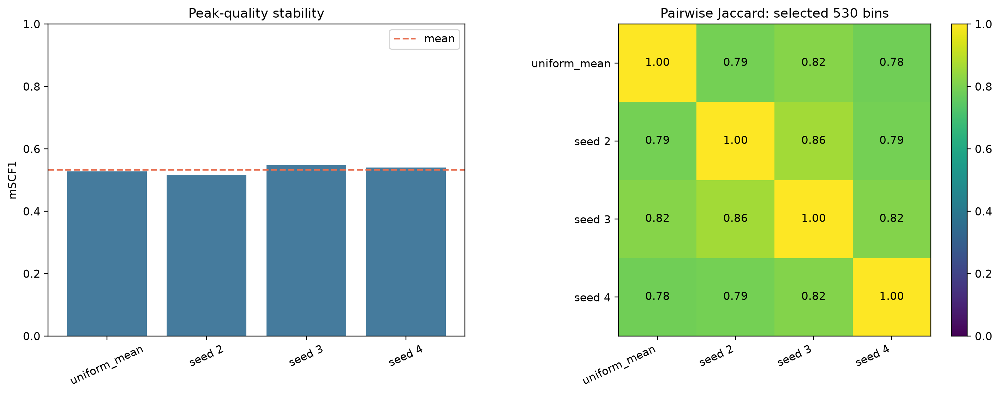

## Whole-GBM nonlinear peak attribution

The frozen uniform-mean Spatial-msiPL model was evaluated on all eight MassNet
GBM sections. Each section used its own legacy msiPL peak count, so every method
was scored at an identical section-specific selection budget.

| Method | Mean mSCF1 | Standard deviation | Median |
|---|---:|---:|---:|
| Spatial-msiPL Integrated Gradients | **0.456** | 0.090 | 0.474 |
| Legacy msiPL | 0.364 | 0.075 | 0.381 |
| First-layer L2 | 0.214 | 0.112 | 0.219 |

Integrated Gradients beat legacy msiPL on all eight sections. The mean absolute
gain was 0.0919 mSCF1 (25.2% relative), with paired section-level Wilcoxon
`p = 0.0078125`. Direction consistency and effect sizes are primary because the
eight sections are not asserted to be eight independent patients.

Integrated Gradients beat the deliberately simple first-layer L2 comparator on
seven of eight sections. `GBM12_1` was the exception. Legacy msiPL is not
equivalent to this L2 comparator: LearnPeaks also traces a selected hidden
neuron toward each latent feature, scales by spectral variability, thresholds
candidates and snaps them to local spectral maxima.

The label-free GMM had mean balanced accuracy 0.911 against the expert masks.
All eight Integrated Gradients completeness checks passed.

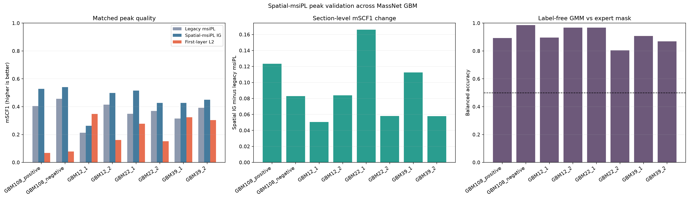

## Matched centre-only attribution control

The same GMM-targeted Integrated Gradients procedure was applied to the frozen
100-epoch centre-only VAEs. Section, seed, hidden and latent dimensions, GMM
settings, attribution settings and peak budget were matched. The intended
difference was the encoder input: centre spectrum alone versus centre plus
uniform-mean neighbourhood context.

| Method | Mean mSCF1 | Standard deviation | Median |
|---|---:|---:|---:|
| **Centre-only IG** | **0.4665** | 0.0820 | 0.4935 |
| Spatial IG | 0.4562 | 0.0898 | 0.4743 |
| Legacy msiPL | 0.3643 | 0.0749 | 0.3809 |
| Spatial first-layer L2 | 0.2139 | 0.1124 | 0.2191 |

Spatial IG won five sections and centre-only IG won three. The mean spatial
minus centre-only change was -0.0103 mSCF1, while the median change was +0.0067.
The paired Wilcoxon result was `p = 0.9453125`. The correct conclusion is that
neighbourhood context did not provide a consistent peak-selection benefit.
The positive median and 5-3 win count show small spatial gains were common, but
two larger centre-only wins (`GBM22_2` and `GBM39_2`) reversed the mean.

Centre-only IG beat legacy msiPL on all eight sections. Its mean improvement
was 0.1022 mSCF1, approximately 28.1% relative, with paired Wilcoxon
`p = 0.0078125`. Spatial IG also beat legacy on all eight sections. Together,
these results identify nonlinear attribution, rather than neighbourhood input,
as the robust source of improved GBM peak selection.

Spatial context may still affect representation structure. Mean GMM balanced
accuracy was 0.9113 for spatial models versus 0.8676 for centre-only models,
although the centre-only mean was strongly reduced by `GBM12_1` (0.3214).
This possible representation-level effect did not translate into a consistent
mSCF1 advantage.

Every centre-only run used a 100-epoch checkpoint, passed all 37 tests, reported
`status: valid`, passed IG completeness and produced the exact matched peak
count. The aggregate summary completed without errors.

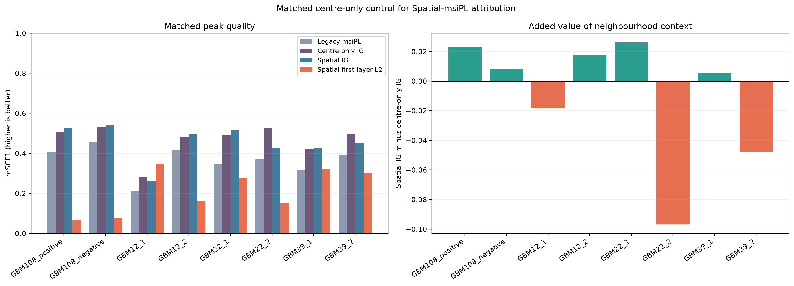

## Frozen CAC validation

The GBM-selected uniform-mean Spatial-msiPL method was frozen and applied to
all eight CAC sections without section-by-section retuning. Each spatial model
was paired with a centre-only model trained for the same 100 epochs, and peak
selection used the same nonlinear GMM-targeted Integrated Gradients procedure.
Legacy msiPL, the two IG methods and S3PL were evaluated at the same
section-specific peak count. S3PL reused its existing ten-epoch checkpoints;
only its final evaluation count was changed, so no S3PL retraining was needed.

| Method | Mean CAC mSCF1 |
|---|---:|
| **S3PL reproduction (matched peak count)** | **0.5915** |
| **Spatial-msiPL IG** | **0.5595** |
| Centre-only IG | 0.5285 |
| Legacy msiPL | 0.4024 |
| Centre-only first-layer L2 | 0.0238 |
| Spatial first-layer L2 | 0.0079 |

Spatial IG beat centre-only IG on all eight CAC sections. The mean absolute
gain was 0.0310 mSCF1 and the exact paired Wilcoxon result was
`p = 0.0078125`. Spatial IG also beat legacy msiPL on all eight sections, with
a mean gain of 0.1572 and the same exact paired `p = 0.0078125`. These are
strong directionally consistent results, while still being interpreted as
section-level evidence rather than eight independent-patient replications.

Against matched-count S3PL, spatial IG won two of eight sections and averaged
0.0320 lower mSCF1. Re-evaluating S3PL at the shared peak counts changed its
mean only from 0.5908 to 0.5915. The earlier peak-count mismatch therefore did
not explain the performance gap. S3PL remains the strongest CAC baseline in
this executable comparison, while its ten-epoch architecture and training
protocol differ from the 100-epoch VAE experiments.

The context benefit was specific to nonlinear peak ranking. Mean GMM balanced
accuracy was 0.6690 for spatial models and 0.6845 for centre-only models
(`p = 0.25`). Reconstruction MSE split four wins each (`p = 1.0`). Spatial IG
had higher deletion faithfulness in six of eight sections, with a mean gain of
0.0405 (`p = 0.078125`). Thus neighbourhood context did not universally
improve reconstruction or latent clustering, but it consistently changed the
nonlinear attribution ranking in a way that improved CAC mSCF1.

Mean training time was 128.4 seconds for spatial models and 125.0 seconds for
centre-only models, both at 100 epochs. S3PL averaged 55.1 seconds at 10 epochs,
so those raw times must not be presented as per-epoch-equivalent. Mean reported
GPU allocation was 68.7 MiB for spatial, 53.3 MiB for centre-only and 97.0 MiB
for S3PL; this is allocated tensor memory, not total device occupancy.

These are the **historical implementation runtimes**, not isolated neural-network
compute costs. Our VAE epoch timer includes HDF5 reads and TIC normalisation,
whereas the legacy msiPL GBM timer starts after loading an in-memory spectrum
matrix; the timing boundaries and the S3PL protocol differ too. A GBM108-positive
phase profile found data preparation dominated the VAE loop, and an opt-in
cache reduced measured batch preparation from 24.704 to 0.724 seconds without
changing checked sample arrays. That initial batch-only result did not, by
itself, establish a full-training speedup; the later full-run result below did.
The historical CAC runtimes above remain unchanged. See the
[runtime investigation](investigations/10%20GBM%20Training%20Runtime%20Investigation.md) for
timing boundaries and the still-needed cross-method cost comparison. GPU tensor
memory must also be reported separately from the extra host RAM used by caching.

A subsequent one-epoch GBM108-positive check using the actual VAE training loop
found 402.1 versus 12.7 seconds for centre-only and 400.8 versus 12.4 seconds
for uniform mean (streaming versus cached), with exactly equal losses and final
model tensors within each pair. That established the first **one-epoch**
implementation speedup; the 100-epoch test followed.

Separate cached 100-epoch GBM108-positive validations have now completed.
Centre-only and uniform mean took 1,309.0 and 1,355.4 seconds of summed epoch
time, respectively, versus 40,178.6 and 40,608.9 seconds in the frozen
streaming runs. Every shared per-epoch history field matched the corresponding
frozen run exactly across all 100 epochs; their initial model-state hashes
also matched. Script wall time to summary was 25.56 and 27.94 minutes for the
cached runs, including setup and checkpoints. This is an implementation/data
pipeline improvement, not a new peak-quality result.

The read-only cluster checkpoint audit subsequently found exact equality for
all 20 final model-state tensors in **both** centre-only and uniform-mean
GBM108-positive runs (job 61491). This closes the parameter-equivalence check
for those two cached-versus-streaming pairs. It does not, by itself, extend
the timing or equivalence result to the other GBM or CAC sections.

### S3PL and cached VAE phase probe

On one RTX 3090 node (`mscluster49`), job 61555 compared S3PL at its 16-pixel
batch size with the cached VAEs at their 128-pixel batch size on
`GBM108_positive`. Steady throughput was 42.1 pixels/s for S3PL and
148.0/149.7 pixels/s for centre-only/uniform VAE. Data preparation occupied
85.9%/92.5%/91.6% of the sampled batch time. Peak allocated GPU memory was
0.238/2.047/2.857 GiB, respectively. These are short training-batch probes,
not whole-workflow measurements; batch sizes and training objectives differ.
S3PL's shorter observed training total on this section uses 10 epochs versus
100 for the VAE. GMM, IG, peak selection and evaluation still need
consistently bounded end-to-end timing. See the
[architecture and timing audit](investigations/11%20S3PL%20Architecture%20and%20Runtime%20Audit.md)
and its [machine-readable phase results](../../code/msi/results/validation/s3pl_cached_vae_phases/61555/).

### Where the matched CAC S3PL lead occurs

At matched peak counts S3PL leads uniform-context IG in mean CAC mSCF1 by
about 0.032 and wins six of eight sections. The mean mixed-F1 lead is 0.0476,
0.0460, 0.0294 and 0.0048 at PCC thresholds 0.3, 0.4, 0.5 and 0.6.
The selected lists share 69.9%–84.6% of their m/z values by section
(mean 79.4%). A direct audit of the stored S3PL labels and independently
recomputed PCC references found *exactly the same* reference-positive bins
for all 32 section–threshold unions and all 96 class comparisons. At a fixed
count, the score difference therefore comes from peaks selected by only one
method. This identifies the set-level source of the gap; it does not identify
which architecture or training choice produced those selections.

The [detailed CAC diagnostic](investigations/12%20CAC%20S3PL%20Gap%20Diagnostics.md)
links the [reference-set audit](../../code/msi/results/comparisons/s3pl_cac_gap_diagnostics/reference_set_audit.json)
and exploratory exclusive-ion images. The GBM S3PL paper-reproduction gap is
a separate unresolved question.

The cross-dataset conclusion is deliberately nuanced. Neighbourhood context
did not consistently improve peak selection on GBM, but it improved it on all
eight CAC sections. Nonlinear Integrated Gradients was the robust contribution
on both datasets. The value of neighbourhood context is therefore
dataset-dependent rather than universal.

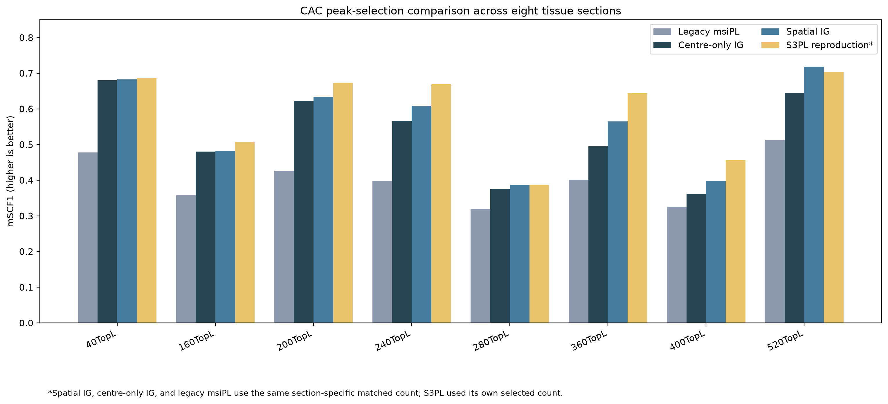

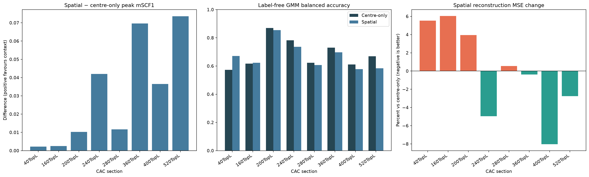

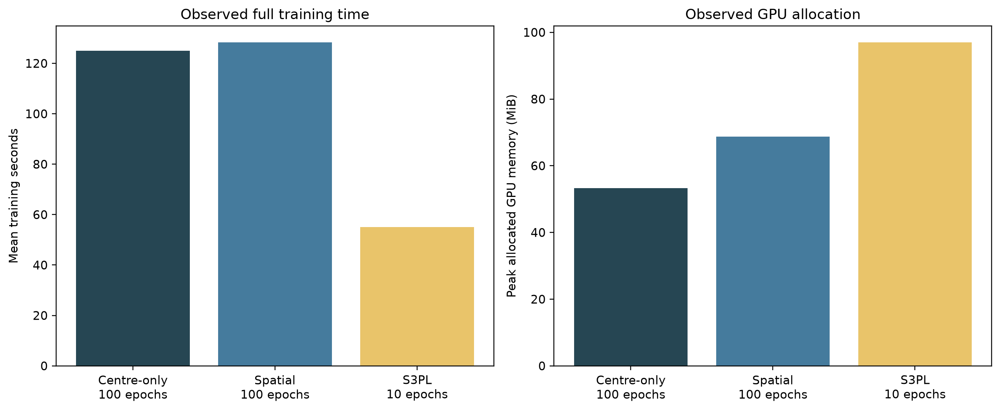

## Targeted training-seed stability

The frozen `GBM108_positive` comparison was repeated with model-training seeds
2 and 3 for centre-only, uniform-mean and corrected-attention VAEs. Together
with seed 1, this gives three independently trained models per variant. The GMM
seed, attribution-pixel sampling seed, evaluation procedure and 530-peak budget
were fixed at 1 so that only model training changed.

| Variant | mSCF1 mean +/- sample SD | GMM balanced accuracy | IG deletion faithfulness | Peak GPU memory |
|---|---:|---:|---:|---:|
| Centre-only | 0.5120 +/- 0.0179 | 0.8745 +/- 0.0039 | 0.1120 +/- 0.0147 | 2.05 GiB |
| Uniform mean | 0.5250 +/- 0.0132 | 0.8735 +/- 0.0274 | **0.1224 +/- 0.0255** | 2.90 GiB |
| Corrected attention | **0.5454 +/- 0.0188** | **0.8822 +/- 0.0072** | 0.1179 +/- 0.0099 | 3.20 GiB |

Corrected attention beat uniform mean in all three training seeds. The
per-seed mSCF1 gains were +0.0347, +0.0120 and +0.0144, giving a mean gain of
+0.0204. This narrowly met the predeclared +0.02 peak-quality requirement.
Uniform mean beat centre-only in two of three seeds and averaged +0.0130, so
the simple context benefit was less stable on this development section.

The attention result did not pass the full predeclared gate. Its deletion
faithfulness was lower than uniform mean in two of three seeds and by 0.0045
on average. The defensible conclusion is therefore that corrected attention
produces a small, training-seed-consistent improvement in matched peak mSCF1 on
`GBM108_positive`, but we do not have evidence that its attribution is more
faithful. This targeted three-seed result does not replace the eight-section
seed-1 validation and should not be presented as whole-dataset multi-seed
replication.

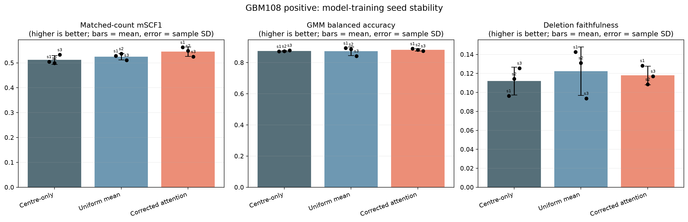

## Spatial window and context controls (3 October 2026)

The seed-1 window campaign has complete local training, reconstruction,
attribution and peak-evaluation artifacts for all 48 configurations: 16
sections (eight CAC, eight MassNet GBM) times three new arms. The arms are a
real 5x5 uniform neighbourhood (`uniform_p5`), zeroed 3x3 context
(`zero_p3`), and a seeded nonlocal shuffled 3x3 context (`shuffled_p3`). Each
is compared with the previously frozen real 3x3 uniform model, using the
same section-specific matched peak count. The two development sections are
`40TopL` and `GBM108_positive`; the seven remaining sections in each
collection form the confirmation sets.

| Confirmation set, mean IG mSCF1 | Real 3x3 | Real 5x5 | Zero 3x3 | Shuffled 3x3 |
|---|---:|---:|---:|---:|
| Seven CAC sections | 0.5419 | 0.5352 | 0.5235 | 0.5425 |
| Seven MassNet GBM sections | 0.4460 | 0.4334 | 0.4594 | 0.4430 |

On CAC, the real 3x3 ranking exceeds zero context by 0.0184 mSCF1 on
average, but is essentially tied with shuffled context (-0.0006). On GBM,
real 5x5 is 0.0126 below real 3x3; zero context is 0.0134 above it, while
shuffled context is 0.0030 below it. The section-level results are mixed, so
these means do **not** show a robust spatial-specificity gain or that more
neighbours help. Equally, they do not prove spatial information is useless:
the controls perturb the input and are only one seed. In particular, the
strong earlier CAC real-3x3 versus centre-only result and the present
real-3x3 versus shuffled near-tie answer different questions and should both
be reported.

Source artifacts: [new window-arm evaluations](../../code/msi/results/experiments/spatial_msipl_window_pilot/), [frozen CAC real-3x3 evaluations](../../code/msi/results/experiments/spatial_msipl_cac_attributed_peak_evaluation/), and [frozen GBM real-3x3 evaluations](../../code/msi/results/experiments/spatial_msipl_attributed_peak_evaluation/). The local completion audit checks each arm's training `summary.json` (`complete`), attribution `summary.json` (`valid`), peak-evaluation `summary.json` (`complete`), and reconstruction JSON; cluster checkpoints were not synced locally. These are seed-1 descriptive comparisons, not a significance or multi-seed claim.

### What the shuffled input changes, and whether frozen models respond

A post-hoc, class-balanced input audit found that shuffled context is not
equivalent to real local context. For sampled centres classified post hoc as
interior from their real neighbours, the fraction of neighbours sharing the
centre's expert class was 1.000 for real context by construction
versus 0.317 for shuffled context on `160TopL`, and 1.000 versus 0.514 on
`GBM22_2`. The [input-information records](../../code/msi/results/diagnostics/spatial_context_information/)
also cover `200TopL` and `GBM39_2`; all four report `valid`. Expert classes
defined these diagnostic groups *after* the label-free context construction.

In a separate frozen-model intervention, the already trained real-context
models reconstructed their sampled training-section pixels worse when fed
shuffled instead of real context: mean scaled cross-entropy increased by 32.89
on `160TopL` and 7,713.04 on `GBM22_2`. The corresponding shuffled-trained
models favoured shuffled input by 6.53 and 421.48, respectively, on the same
cross-entropy scale. The [frozen-model records](../../code/msi/results/diagnostics/spatial_context_model_sensitivity/)
show the same direction separately for boundary and interior groups. These
results establish that the sampled inputs carry different local information
and that the saved models respond to it; they do **not** show that real context
improves peak selection. The swaps are out-of-training-distribution
interventions on training sections, not held-out performance or causal tests.
The saved-latent audit below separates representation, clustering and
peak-ranking effects.

### Saved latent information versus the fitted GMM

A label-free GMM was refitted five times to each saved five-dimensional latent
representation, then its components were compared with expert classes *post
hoc*. On `GBM22_2`, the saved real-context model's GMM had class ARI 0.165,
versus 0.888 for the shuffled-context model; the five refits stayed near
those values. Yet both saved representations had about 0.985 balanced accuracy
under a label-trained linear probe, and about 0.978 same-class ten-nearest-
neighbour purity. Thus expert-class information is accessible in both GBM
latents, while this particular unsupervised GMM partitions them very
differently. On `160TopL`, real/shuffled GMM ARI was 0.474/0.383, linear-probe
balanced accuracy 0.752/0.747, and ten-neighbour purity 0.760/0.762. See the
[latent-separability records](../../code/msi/results/diagnostics/spatial_latent_separability/)
for the saved-model hashes, counts and refit seeds.

The probe uses expert labels and five random pixel folds within the *same
training section*. Nearby pixels and the same patient/section can occur in
both train and test folds, so its accuracy is not patient-independent
validation and is **not** an unsupervised result. ARI and neighbour purity
also use labels only for post-hoc assessment; none of these diagnostics is a
peak-picking score or a causal explanation for mSCF1. A subsequent
[frozen-latent clusterer audit](../../code/msi/results/diagnostics/spatial_unsupervised_clusterers/)
compared covariance structures and KMeans without retraining or selecting by
expert labels. Full-covariance GMM still had the lowest BIC on both tested
sections; on `GBM22_2` real context, a tied-covariance GMM had much higher
post-hoc class ARI (0.899 versus 0.165) but substantially worse BIC. Thus
changing the clusterer solely to improve agreement with the expert mask would
be label-guided method selection, not an unsupervised correction. The completed
48-arm window campaign does not support promoting fixed uniform averaging
as the final spatial method; it remains a useful control while learned
neighbourhood mechanisms are investigated.

### Targeted learned-attention context check (4 October 2026)

Matched real-context and seeded nonlocal shuffled-context attention models
were trained for 100 epochs at seed 1 on `160TopL` and `GBM22_2`. All four
local training, reconstruction, attribution and peak-evaluation summaries
report complete or valid status. At the frozen section peak count, Integrated
Gradients gave:

| Section | Peaks | Real attention mSCF1 | Shuffled attention mSCF1 |
|---|---:|---:|---:|
| `160TopL` | 210 | 0.4662 | 0.4618 |
| `GBM22_2` | 464 | 0.4364 | 0.4422 |

The real-minus-shuffled differences are +0.0044 and -0.0058 respectively;
these two single-seed sections do not establish a consistent spatial-specific
peak-selection advantage for learned attention. On `GBM22_2`, post-hoc GMM
class ARI was 0.147 for real attention and 0.204 for shuffled attention, so
the earlier uniform-mean model's large shuffled-GMM advantage does not simply
carry over to this learned aggregator. See the
[four attention result sets](../../code/msi/results/experiments/spatial_attention_context/).
The following frozen-model ablation separates the Integrated Gradients
contributions of the centre and neighbour input branches without retraining.

### Frozen attention Integrated Gradients contribution ablation

For each saved attention model, only the *ranking score* changed: combined,
centre contribution alone, or neighbour contribution alone. The model,
fitted GMM, IG target and sampled pixels stayed fixed within an arm. Both
[ablation summaries](../../code/msi/results/diagnostics/spatial_ig_component_ablation/)
are valid and reproduce the original combined ranking exactly.

| Section and context | Matched bins | Combined mSCF1 | Centre-only mSCF1 | Neighbour-only mSCF1 |
|---|---:|---:|---:|---:|
| `160TopL` real | 210 | 0.4662 | 0.4593 | 0.4507 |
| `160TopL` shuffled | 210 | 0.4618 | 0.4593 | 0.4232 |
| `GBM22_2` real | 464 | 0.4364 | 0.4306 | 0.4252 |
| `GBM22_2` shuffled | 464 | 0.4422 | 0.4545 | 0.3122 |

Real-neighbour-only rankings beat shuffled-neighbour-only rankings on both
sections, by 0.0275 and 0.1130 mSCF1. Yet the combined real-versus-shuffled
comparison remains mixed. Central input also accounts for the larger share
of absolute IG magnitude in every GMM component: 0.598-0.703 in real and
0.739-0.755 in shuffled `160TopL` models; 0.532-0.576 in real and
0.702-0.742 in shuffled `GBM22_2` models. These are contributions within
*jointly trained contextual models*, not scores from separately trained
centre-only and neighbour-only models. The real and shuffled arms have their
own trained weights and GMMs, so their component-ranking difference is not
causal proof that spatial topology improves peak selection. A bounded
same-checkpoint input-swap or topology counterfactual is the next logical
test before asserting spatial specificity.

### Frozen learned-attention neighbour-input swap (5 October 2026)

The [16 section summaries](../../code/msi/results/diagnostics/spatial_attention_input_swap/)
all report `valid` (eight CAC, eight MassNet GBM), with complete saved
real-attention training summaries. For each section, the diagnostic held the
trained real-attention checkpoint and a GMM fitted once on its real-input
latents fixed, then replaced the neighbour slots with the seeded nonlocal
shuffle. It did not retrain either model or refit the GMM between conditions.

Shuffled-input reconstruction MSE was higher in **all 16 sections**:
**1.36–3.38 times** the real-input MSE. The fixed GMM changed its assigned
component for a mean **4.27% of CAC pixels** and **8.48% of GBM pixels**
(unweighted section means). Thus the learned-attention model responds to
neighbour inputs even when its parameters and clusterer are held constant.
This is an in-sample response to an intervention that may be outside the
real-neighbour training distribution. It is **not** a demonstration that
spatial topology improves selected peaks: no Integrated Gradients ranking,
matched-count mSCF1, or molecular interpretation was recomputed in this
diagnostic. The separately trained real-versus-shuffled attention pilots and
the component-ranking ablation above remain mixed on peak quality.

### Frozen attention peak-ranking input swap (5 October 2026)

The [16 ranking-swap summaries](../../code/msi/results/diagnostics/spatial_attention_frozen_ranking_swap/)
report `valid`. Each test reused one real-neighbour-trained attention
checkpoint, its real-input GMM, the same attribution pixels and component
targets, and the same section-specific peak budget. Only the neighbour spectra
were shuffled when recomputing Integrated Gradients. The original real-input
peak order and mSCF1 were reproduced exactly before scoring the shuffled
ranking. These are *same-model input interventions*, unlike the separately
trained real-versus-shuffled comparison above.

| Development section | Matched bins | Real-input mSCF1 | Shuffled-input mSCF1 | Shared selected bins |
|---|---:|---:|---:|---:|
| `160TopL` | 210 | 0.4662 | 0.4843 | 179 |
| `GBM22_2` | 464 | 0.4364 | 0.4678 | 411 |

At PCC thresholds 0.3, 0.4, 0.5 and 0.6, the shuffled ranking added
**9, 4, 0, 0** matched true-positive bins on `160TopL` and
**13, 19, 23, 23** on `GBM22_2`, respectively, compared with the frozen
real ranking. Integrated Gradients completeness passed in both sections.
Across all 16 sections, the real ranking was better on 4/8 CAC and 1/8 GBM
sections; the shuffled ranking was better on 4/8 CAC and 7/8 GBM sections.
The mean shuffled-minus-real mSCF1 difference was +0.0049 on CAC and +0.0183
on GBM. Neighbour input changes some peak choices, but the effect is mixed on
CAC and usually does not favour *real* neighbours on GBM. Because the
checkpoint was trained on real neighbours, shuffled inputs may be out of
distribution. These are seed-1 section-level observations, not a causal
demonstration that shuffling improves the method.

### Changed-peak audit of the frozen attention ranking swap (5 October 2026)

The [16 CPU-only changed-peak audits](../../code/msi/results/diagnostics/spatial_attention_changed_peaks/)
report `valid` and reproduced both frozen mSCF1 scores for every section. The
`changed_bins.csv` files identify every bin entering or leaving the selected
list, its m/z, per-class PCC and status under the existing four-threshold
reference rule. The figures show all changed-bin PCC distributions and the
highest-ranked three entering and three leaving ion images per section;
individual ion maps are scaled separately and are qualitative illustrations.

| Example section | Entering / leaving bins | Net reference-positive entering minus leaving at PCC 0.3, 0.4, 0.5, 0.6 |
|---|---:|---|
| `160TopL` | 31 / 31 | +9, +4, 0, 0 |
| `240TopL` | 37 / 37 | −10, −11, −9, −3 |
| `400TopL` | 28 / 28 | +13, +6, +3, 0 |
| `GBM12_2` | 53 / 53 | +30, +34, +35, +26 |
| `GBM22_2` | 53 / 53 | +13, +19, +23, +23 |

The changed reference-positive counts explain the score differences under
the existing four-threshold rule: some sections gain and others lose when the
ranking is recomputed with shuffled neighbours. Two of the highest-ranked
`GBM22_2` entering ion maps (m/z 541.904 and 399.971) visibly concentrate in the expert tumour
region and have positive tumour-class PCCs of 0.789 and 0.763. This is
post-hoc evidence of better mask alignment for these selected ions, **not**
proof of their molecular identities or that shuffling improves the trained
model. The cause of the ranking shift remains unresolved: the intervention
may be out of distribution, and the 16 sections represent one training seed
per section (with multiple GBM sections from the same patients). The
[local comparison figures](../../results/README.md) show the collection-level
pattern; they do not turn this post-hoc audit into a deployment comparison.

### Centre–context distribution screen for the frozen shuffle (6 October 2026)

The [CPU-only screen](../../code/msi/results/diagnostics/spatial_attention_context_shift/)
recreated the exact seed-1701 shuffle used above (saved source-slot hashes
matched). It sampled 512 measured centres in each of the two earlier
exploratory sections, with no zero-spectrum exclusions, masks, model, GMM,
IG or peak evaluation. The cosine compares the *spectral pattern* of each
centre with its mean context; half-L1 measures their absolute difference.

| Section | Median cosine, real → shuffled | Shuffled cosine below real 5th percentile | Median half-L1, real → shuffled | Shuffled half-L1 above real 95th percentile |
|---|---:|---:|---:|---:|
| `160TopL` | 0.984 → 0.811 | 81.1% | 0.164 → 0.420 | 92.0% |
| `GBM22_2` | 0.979 → 0.889 | 66.2% | 0.212 → 0.346 | 70.9% |

Both sampled sections show a substantial shift in the centre–context
relationship under this nonlocal shuffle. This strengthens the
**out-of-distribution warning** for feeding shuffled neighbours into a
real-neighbour-trained checkpoint: the frozen ranking-swap gains cannot be
interpreted as evidence that realistic shuffled deployment or real spatial
context is harmful. This screen measures only two simple input statistics,
on outcome-known sections with spatially dependent sampled pixels; it does
not prove the full model input is out of distribution or identify why IG
rankings changed. The separately trained real-versus-shuffled attention
comparison above is the relevant, though still single-seed, peak-quality
control.

### Matched learned-attention training-seed repeat (7 October 2026)

The [seed-2/3 result sets](../../code/msi/results/experiments/spatial_attention_context_seed_stability/)
are complete for both exploratory sections and both arms (8/8). They extend
the already completed seed-1 pilot. Each pair used the same initial VAE state
within its training seed, 100 epochs, corrected 3×3 attention, and the same
section-specific peak count. The shuffled-context source map remained fixed
at seed 1701 and its saved hash matched across training seeds; downstream
GMM/IG sampling seeds remained fixed. All twelve training, attribution and
peak-evaluation summaries report complete/valid/complete, and all twelve IG
completeness checks passed. The first seed-2 `160TopL` shuffled allocation
stopped at concurrent shared-folder creation; its single-index retry completed
without changing the scientific settings.

| Section | Training seed | Real mSCF1 | Separately trained shuffled mSCF1 | Real − shuffled |
|---|---:|---:|---:|---:|
| `160TopL` | 1 | 0.4662 | 0.4618 | +0.0044 |
| `160TopL` | 2 | 0.4843 | 0.4906 | −0.0063 |
| `160TopL` | 3 | 0.4834 | 0.4748 | +0.0086 |
| `GBM22_2` | 1 | 0.4364 | 0.4422 | −0.0058 |
| `GBM22_2` | 2 | 0.4176 | 0.4492 | −0.0316 |
| `GBM22_2` | 3 | 0.4617 | 0.4833 | −0.0217 |

The constituent mixed-class F1 scores make clear which PCC thresholds drove
the mean (real/shuffled shown in each cell):

| Section | Seed | PCC 0.3 | PCC 0.4 | PCC 0.5 | PCC 0.6 |
|---|---:|---:|---:|---:|---:|
| `160TopL` | 1 | .7166/.7112 | .6422/.6300 | .3893/.3893 | .1166/.1166 |
| `160TopL` | 2 | .7647/.7701 | .6667/.6789 | .3893/.3969 | .1166/.1166 |
| `160TopL` | 3 | .7594/.7326 | .6606/.6606 | .3969/.3893 | .1166/.1166 |
| `GBM22_2` | 1 | .3958/.4021 | .4290/.4303 | .4500/.4633 | .4711/.4731 |
| `GBM22_2` | 2 | .3851/.4011 | .4005/.4493 | .4300/.4733 | .4545/.4731 |
| `GBM22_2` | 3 | .4064/.4233 | .4520/.4817 | .4883/.5117 | .5000/.5165 |

Mean paired real-minus-shuffled change was +0.0022 mSCF1 on `160TopL`
(range −0.0063 to +0.0086) and −0.0197 on `GBM22_2` (range −0.0316 to
−0.0058). Thus real context did **not** meet the predeclared +0.02 practical
promotion signal on either section. CAC changes sign with the seed; on this
GBM section shuffled training won all three, but the two sections were
outcome-known exploratory choices, not independent validation. GBM within-arm
seed ranges were also material (real 0.4176–0.4617, shuffled 0.4422–0.4833).
Unrounded scores and the confusion counts remain in each linked
`peak_evaluation/summary.json`.

The reconstruction MSE did not track a consistent real-context benefit:
`160TopL` real/shuffled pairs were 9.589/9.675, 9.671/9.534 and 9.315/9.636
×10⁻⁷ for seeds 1–3; `GBM22_2` pairs were 1.864/2.005, 2.913/2.873 and
2.882/2.897 ×10⁻⁹. IG completeness is a numerical consistency check, not
proof that every peak ranking is faithful: at a 128-bin deletion budget, IG
exceeded the random posterior-drop control for only 2/3 CAC components in
each arm/seed; GBM was usually 1/2 components (shuffled seed 2 was 2/2).
The shuffled GBM attribution stage took about 32–33 minutes per seed versus
17–18 minutes for real context, despite similar ~42–44-minute training times.
GPU peak allocation was about 3.20 GiB for GBM and 0.07 GiB for CAC; these
are **not** peak host-RAM measurements and do not justify the 32-GB Slurm
request by themselves. Node hardware and queue wait differ, so this is not a
matched-hardware runtime benchmark.

The bounded repeat resolves the seed-1 ambiguity only for these two tested
configurations: no reproducible real-neighbour peak-quality advantage appears
here. It does not prove that spatial context is generally useless, explain
the CAC–GBM difference, or validate shuffled context as a deployment method.
