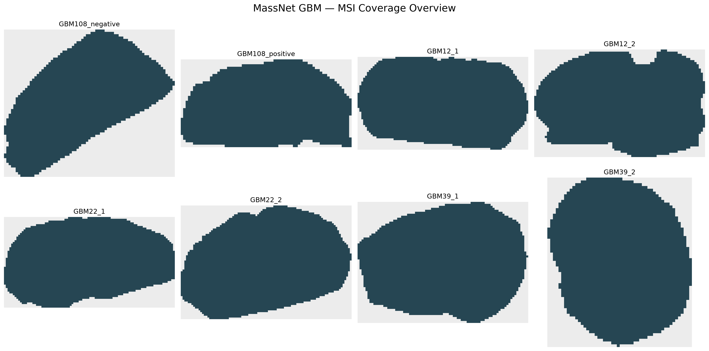
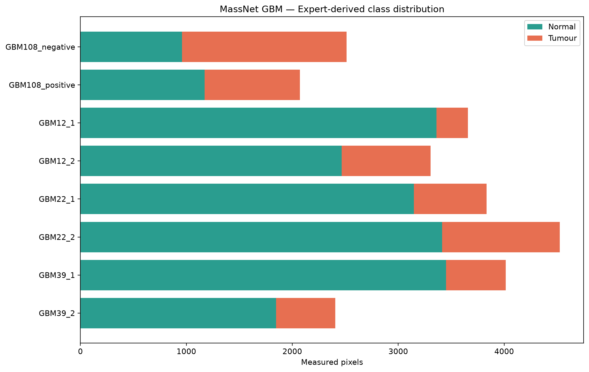
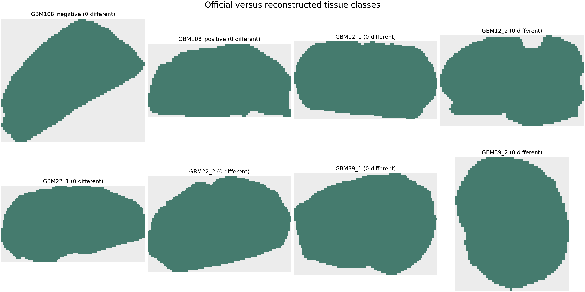
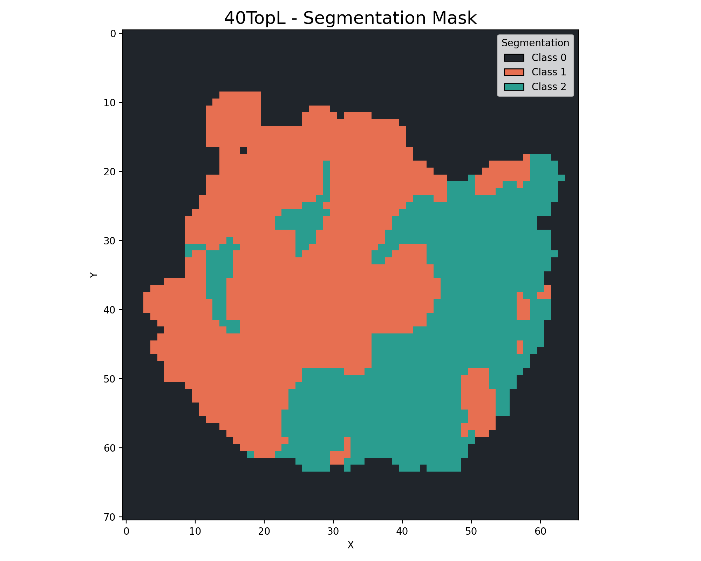

# Datasets and Preprocessing

## MassNet GBM

### Sections

| Section | Shape (y × x) | Measured pixels | Coverage | Normal | Tumour |
|---|---:|---:|---:|---:|---:|
| GBM108_negative | 63 × 73 | 2,512 | 54.62% | 960 | 1,552 |
| GBM108_positive | 36 × 70 | 2,071 | 82.18% | 1,173 | 898 |
| GBM12_1 | 49 × 90 | 3,658 | 82.95% | 3,362 | 296 |
| GBM12_2 | 51 × 81 | 3,306 | 80.03% | 2,466 | 840 |
| GBM22_1 | 51 × 96 | 3,835 | 78.33% | 3,147 | 688 |
| GBM22_2 | 64 × 96 | 4,524 | 73.63% | 3,415 | 1,109 |
| GBM39_1 | 61 × 86 | 4,015 | 76.53% | 3,451 | 564 |
| GBM39_2 | 61 × 52 | 2,406 | 75.85% | 1,848 | 558 |

All sections use the same 85,062-bin m/z axis. `Class_Label` contains expert
pathologist H&E annotations transferred to measured MSI coordinates.





### Mask construction

The HDF5 files provide measured coordinates and class labels. A dense display
mask is created by placing each class at its `(x, y)` position while retaining a
separate coverage mask. Unmeasured grid positions are neither normal nor tumour.

This separation is essential. Treating unmeasured background as a biological
class would corrupt PCC labels, spatial neighbourhoods and accuracy measures.

### Official imzML validation

The separately acquired official imzML dataset used mask values `0=background`,
`1=normal`, `2=tumour`. The HDF5-derived representation used coverage plus
`0=normal`, `1=tumour`. After translating encodings, all measured pixels agreed
semantically in all eight sections.



## CAC

### Sections

| Section | Image shape | Measured spectra | Coverage | Spectral bins |
|---|---:|---:|---:|---:|
| 40TopL | 66 × 71 | 4,686 | 100% | 1,481 |
| 160TopL | 69 × 69 | 4,761 | 100% | 1,481 |
| 200TopL | 67 × 59 | 3,953 | 100% | 1,481 |
| 240TopL | 70 × 67 | 4,690 | 100% | 1,481 |
| 280TopL | 67 × 69 | 4,160 | 89.98% | 1,481 |
| 360TopL | 71 × 64 | 4,544 | 100% | 1,481 |
| 400TopL | 76 × 62 | 4,712 | 100% | 1,481 |
| 520TopL | 69 × 47 | 3,243 | 100% | 1,481 |

The m/z range is approximately 198.03–1060.68. The masks have three classes.
The biological class names must be taken from the dataset documentation; the
code preserves numeric classes rather than inventing names.



### The 280TopL exception

`280TopL` initially exposed an assumption that mask shape and measured
coordinate extent would always match. Its partial coverage means the dense mask
contains locations without spectra. The adapter was corrected to align classes
at measured coordinates instead of reshaping spectra as a full rectangle.

This explains why the section could take longer or fail under dense-grid logic,
but partial coverage itself is not evidence of bad data.

## HDF5 orientation

The loaders accept either:

```text
(pixels, m/z bins)
```

or:

```text
(m/z bins, pixels)
```

They infer orientation using coordinate and m/z lengths. They also require a
strictly increasing m/z axis and unique positive coordinates.

## TIC normalisation

For every measured spectrum:

```text
x_normalised = x / sum(x)
```

Zero-total spectra remain zero. Negative and non-finite intensities are rejected.
Neighbour spectra are normalised individually before aggregation, and the final
context spectrum is normalised again.

## Spatial neighbourhood construction

Coordinates are one-based. For each centre, the code looks up the eight Moore
offsets. A slot contains the neighbouring pixel index only if that coordinate
was measured. This makes edge pixels and holes safe without padding them with
fake tissue measurements.

## Data locations

Raw data and archives remain outside Git:

```text
/datasets/zsuliman/msi_data/cac/
/datasets/zsuliman/msi_data/cac_msipl/
/datasets/zsuliman/msi_data/gbm_massnet/
/datasets/zsuliman/msi_data/zips/
```

Only adapters, compact summaries, masks where appropriate, metrics and figures
belong in the repository.
