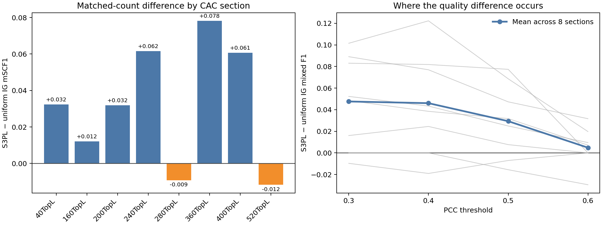
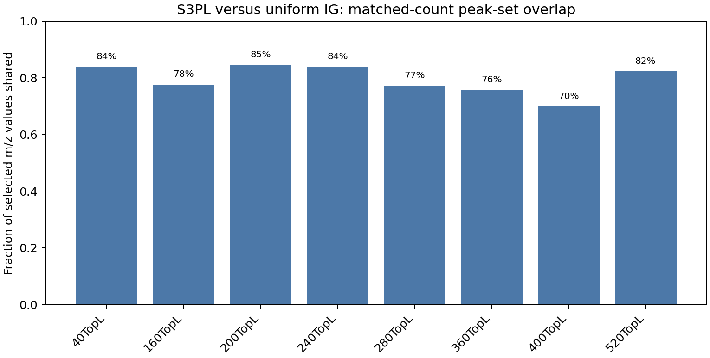
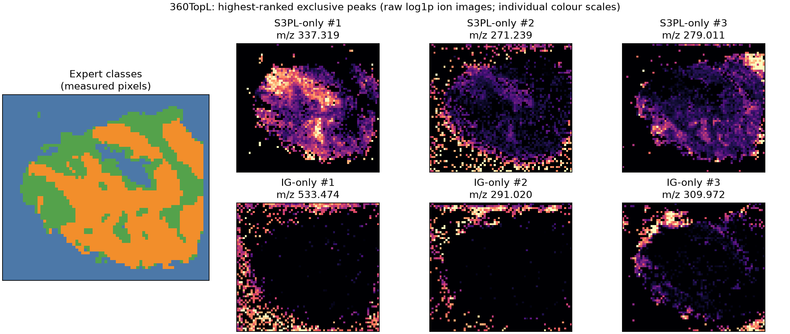
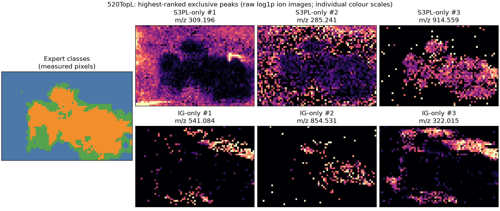

# Where does the matched-count CAC S3PL quality gap occur?

Status: all-eight-section frozen-result diagnostic, representative raw ion-image job **61557**, and reference-set audit **61566** completed. This extends the [S3PL architecture and runtime audit](11%20S3PL%20Architecture%20and%20Runtime%20Audit.md). No model was retrained or re-evaluated.

## What was compared

For each of the eight CAC sections, this analysis reads the existing matched-count S3PL `metrics.json` and selected-peak CSV, and our frozen uniform-context IG `summary.json` and selected-peak CSV. It verifies that each list has exactly the section's matched peak budget and that the source mSCF1 values agree with the existing aggregate CSV. Peak overlap is an **exact selected m/z-value match** on the same section, not an approximate tolerance window or a molecule identification. The methods' training, normalisation and ranking protocols remain different even though the final peak count is matched.

The four mixed-class F1 values are indexed by PCC threshold $t \in \{0.3,0.4,0.5,0.6\}$. Positive differences below mean S3PL scored higher. The section mSCF1 is the mean over those four thresholds. S3PL's saved mSCF1 is rounded to three decimals; threshold-level F1 is retained at full stored precision, so small differences in the displayed aggregates are expected.

## Findings from the frozen artifacts

| PCC threshold | Mean S3PL − uniform IG mixed F1 | S3PL wins / IG wins / ties (8 sections) |
|---|---:|---:|
| 0.3 | +0.0476 | 6 / 1 / 1 |
| 0.4 | +0.0460 | 6 / 1 / 1 |
| 0.5 | +0.0294 | 6 / 2 / 0 |
| 0.6 | +0.0048 | 4 / 1 / 3 |

The mean matched-count mSCF1 difference is about +0.032 for S3PL, with wins on six of eight sections. The largest S3PL lead is **360TopL (+0.078)**; the largest IG lead is **520TopL (+0.012 in IG's direction)**. In 360TopL, S3PL's advantage is especially visible at 0.3 and 0.4 (+0.101 and +0.122). At 520TopL, the two methods tie at 0.3/0.4 but IG leads at 0.5/0.6. Thus S3PL's aggregate advantage is **not uniform across PCC thresholds**. These are descriptive paired observations, not evidence of a causal mechanism or a new significance test.

The two matched-size selected lists share **69.9%–84.6%** of their m/z values by section (mean of section fractions: **79.4%**). For example, 360TopL shares 187 of 247 peaks (75.7% of each list), whereas 520TopL shares 191 of 232 (82.3%). The published F1 calculation ignores the order of selected peaks. The direct audit below confirms that both evaluators use **exactly the same reference-positive bin sets**. Therefore, at a fixed count, shared selected peaks contribute identically and each F1 difference comes from the method-exclusive selections.

At matched selected count $N$ and reference-positive count $T$, $F1=2TP/(N+T)$. Using the IG evaluator's saved $T$ and S3PL's full-precision F1, the inferred S3PL $TP$ is an exact integer for **all 32 section-threshold combinations**. On 360TopL, S3PL-minus-IG true-positive differences are **+24, +25, +12, +3** across thresholds 0.3–0.6. On 520TopL they are **0, 0, −3, −5**. The direct reference-set audit now validates the shared-reference assumption used in this calculation. These counts identify the set-level source of the F1 difference; they do not identify which modelling choice caused the different selections.





Machine-readable [diagnostics JSON](../../../code/msi/results/comparisons/s3pl_cac_gap_diagnostics/diagnostics.json) includes every section's score difference, threshold differences, shared counts, Jaccard values, and rank-ordered method-exclusive m/z lists. The reproducible [analysis script](../../../code/msi/scripts/analyse_s3pl_cac_gap.py) reads the frozen files and writes these figures; it does not use expert masks to choose or train peaks.

## Raw ion-image check (job 61557)

The CPU-only [cluster job](../../../code/msi/slurm_jobs/visualise_s3pl_cac_gap_ions.sh) completed with an empty error log on `mscluster49`. It read the existing CAC HDF5 adapters, not checkpoints. It drew expert-class maps and raw log-intensity ion images for the **first three highest-ranked peaks unique to each method** on 360TopL (largest S3PL lead) and 520TopL (largest IG lead). Choosing sections by observed outcomes makes this an **exploratory illustration**, not a held-out validation. Choosing images by rank rather than PCC avoids picking visually favourable ions from each list. The mask is displayed only after selection and never enters training or ranking.

The submitted command was:

```bash
cd ~/msi
sbatch slurm_jobs/visualise_s3pl_cac_gap_ions.sh
```

The figures are [360TopL](../../../results/model-comparisons/cac_360TopL_s3pl_ig_exclusive_ions.png) and [520TopL](../../../results/model-comparisons/cac_520TopL_s3pl_ig_exclusive_ions.png); the [job log](../../../code/msi/logs/cac-gap-ions-61557.out) records the allocation. The panels use **individual colour scales** and show spatial pattern, not directly comparable absolute intensity. Missing grid locations are grey; the class map is post-hoc reference context.





Visually, 360TopL's first S3PL-only ion (m/z 337.319) has a clear within-tissue spatial pattern, while two of the first IG-only examples (m/z 533.474 and 291.020) are most prominent around the tissue perimeter. On 520TopL, S3PL-only m/z 309.196 is relatively diffuse, while IG-only m/z 322.015 highlights a spatially concentrated region. These are **descriptions of six selected examples per section**, not a quantitative explanation of the mSCF1 difference. Different per-image intensity scales, raw rather than model-normalised values, tissue boundaries and the outcome-based choice of sections all limit what can be inferred from appearance.

## What remains to test before explaining the gap

This analysis identifies **where** S3PL's score lead occurs, not **why**. Plausible contributors include its different patch-reconstruction objective, reference normalisation, learned spatial convolution, per-pixel attention aggregation, and ranking strategy. The next controlled comparison should change one factor at a time while freezing the section, peak budget and evaluator. In particular, the normalisation difference documented in the preceding audit is testable without claiming beforehand that it causes the observed pattern.

The **read-only direct reference-set audit** completed as job 61566 on `mscluster49`, with an empty error log. It compared S3PL's stored class PCC rankings with PCC independently recomputed from the existing CAC HDF5 adapters, then compared each class and mixed reference-positive *bin set* at all four thresholds. The [audit report](../../../code/msi/results/comparisons/s3pl_cac_gap_diagnostics/reference_set_audit.json) records `exact_reference_set_match`: **zero symmetric-difference bins in every one of the 32 section-threshold comparisons**. The maximum PCC difference reported for each class was also zero. It did not train, change the labels, or rewrite any model result. The [job output](../../../code/msi/logs/cac-ref-audit-61566.out) lists all eight sections. The submitted command was:

```bash
cd ~/msi
sbatch slurm_jobs/audit_s3pl_cac_reference_sets.sh
```

This removes the reference-definition caveat from the matched-count CAC F1 comparison. It does **not** make S3PL and the VAE/IG pipelines architecturally or computationally matched, nor does it explain why their exclusive peaks differ.
